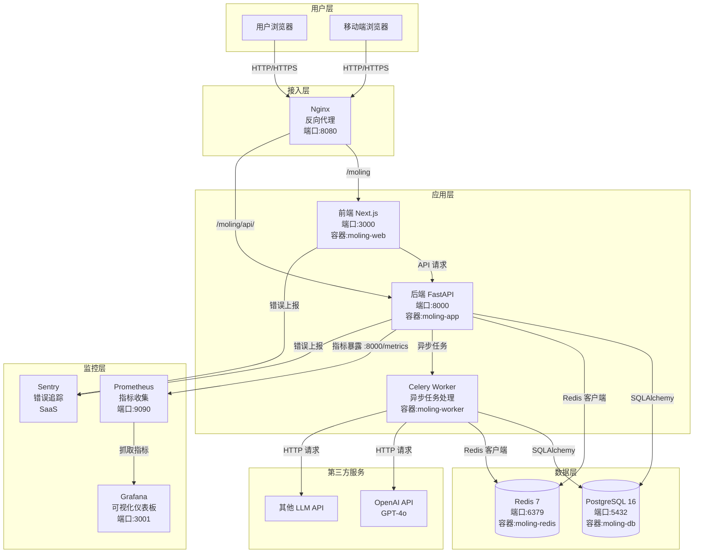
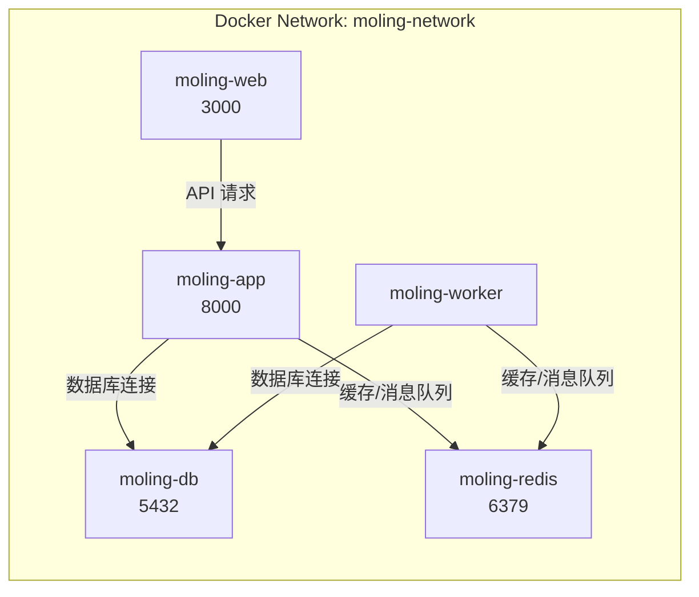
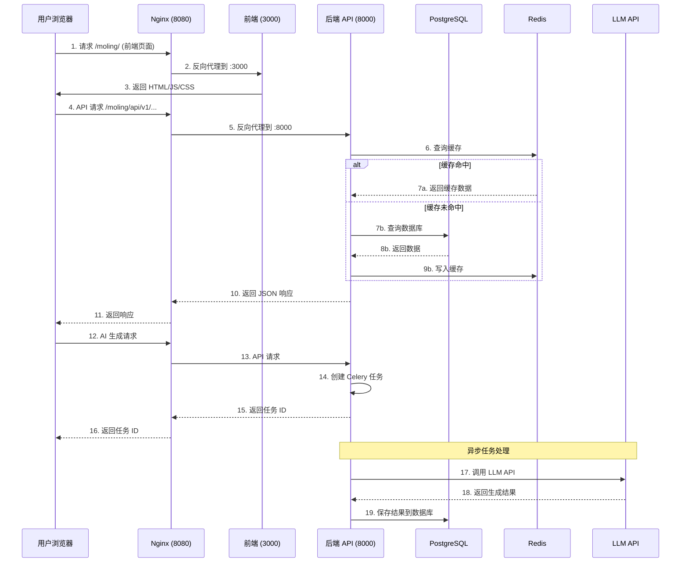
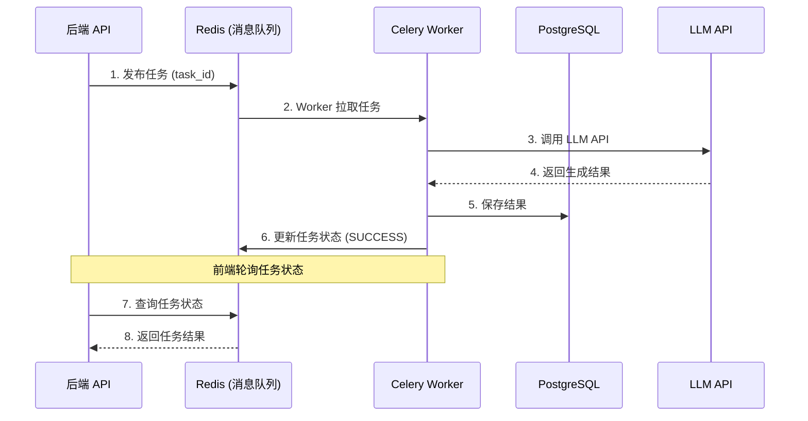
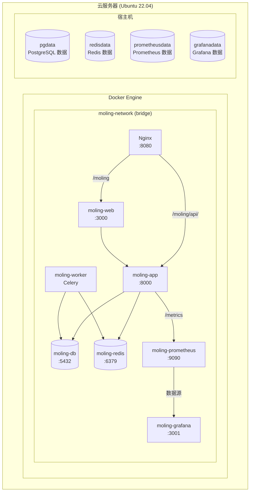
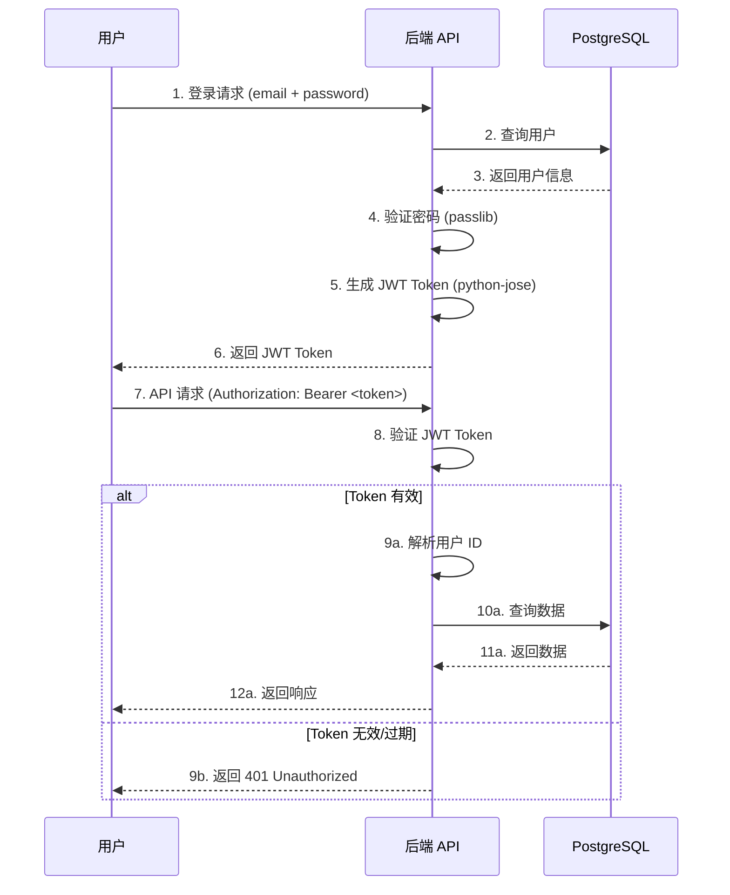

# 墨灵(Moling) 系统架构说明

> **文档版本**: 1.0.0  
> **最后更新**: 2026-06-16  
> **维护者**: Moling Team  
> **适用人员**: 开发人员、运维人员、架构师

---

## 目录

1. [系统概述](#系统概述)
2. [系统架构图](#系统架构图)
3. [数据流图](#数据流图)
4. [技术栈说明](#技术栈说明)
5. [部署架构](#部署架构)
6. [第三方服务](#第三方服务)
7. [目录结构](#目录结构)
8. [安全架构](#安全架构)

---

## 系统概述

**墨灵(Moling)** 是一个 AI 辅助小说创作平台，帮助用户通过 AI 能力进行小说创作、角色设定、情节设计等。

### 核心功能

- 📝 **小说创作**：提供 AI 辅助的小说写作功能
- 👤 **角色管理**：创建和管理小说角色
- 📚 **项目管理**：管理多个小说项目
- 🤖 **AI 生成**：基于 LLM 的内容生成（情节、对话、描述等）
- 📊 **知识库**：存储和管理创作素材

### 架构特点

- **前后端分离**：前端（Next.js）+ 后端（FastAPI）
- **容器化部署**：使用 Docker Compose 编排服务
- **异步任务处理**：使用 Celery 处理耗时任务（AI 生成、文档处理）
- **缓存优化**：使用 Redis 缓存热点数据
- **监控告警**：Prometheus + Grafana + Sentry

---

## 系统架构图

### 整体架构



### 网络拓扑



---

## 数据流图

### 用户请求流程



### 异步任务流程



---

## 技术栈说明

### 后端技术栈

| 技术 | 版本 | 用途 | 说明 |
|------|------|------|------|
| **Python** | >= 3.10 | 编程语言 | 后端主要开发语言 |
| **FastAPI** | >= 0.115.0 | Web 框架 | 高性能异步 Web 框架 |
| **Uvicorn** | >= 0.34.0 | ASGI 服务器 | FastAPI 的生产服务器 |
| **SQLAlchemy** | >= 2.0.36 | ORM | 异步数据库操作 |
| **Alembic** | >= 1.14.0 | 数据库迁移 | 管理数据库 schema 变更 |
| **PostgreSQL** | 16 | 关系数据库 | 主数据库（pgvector 扩展支持向量搜索） |
| **Redis** | 7 | 缓存/消息队列 | 缓存 + Celery 消息队列 |
| **Celery** | >= 5.5.0 | 异步任务 | 处理耗时任务（AI 生成等） |
| **Pydantic** | >= 2.10.0 | 数据验证 | 请求/响应数据验证 |
| **python-jose** | >= 3.3.0 | JWT 处理 | 用户认证和授权 |
| **passlib** | >= 1.7.4 | 密码哈希 | 用户密码加密 |
| **httpx** | >= 0.28.0 | HTTP 客户端 | 调用外部 API（LLM 等） |
| **structlog** | >= 24.4.0 | 结构化日志 | 统一的日志格式 |
| **tenacity** | >= 9.0.0 | 重试机制 | API 调用重试 |
| **prometheus-fastapi-instrumentator** | >= 7.0.0 | 指标收集 | 暴露 Prometheus 指标 |
| **sentry-sdk** | >= 2.0.0 | 错误追踪 | 实时监控和错误上报 |
| **slowapi** | >= 0.1.9 | 限流 | API 速率限制 |

### 前端技术栈

| 技术 | 版本 | 用途 | 说明 |
|------|------|------|------|
| **Node.js** | >= 18.0.0 | JavaScript 运行时 | 前端开发环境 |
| **Next.js** | ^15.1.0 | React 框架 | 前端主框架（App Router） |
| **React** | ^19.0.0 | UI 库 | 用户界面构建 |
| **TypeScript** | ^5.7.0 | 类型系统 | 类型安全开发 |
| **Zod** | ^4.4.3 | 数据验证 | 前端数据验证（配合 React Hook Form） |
| **Sentry** | ^10.58.0 | 错误追踪 | 前端错误监控 |
| **Playwright** | ^1.60.0 | E2E 测试 | 端到端测试 |
| **Vitest** | ^4.1.8 | 单元测试 | 单元测试框架 |

### 基础设施技术栈

| 技术 | 版本 | 用途 | 说明 |
|------|------|------|------|
| **Docker** | 20.10.0+ | 容器运行时 | 应用容器化 |
| **Docker Compose** | 2.0.0+ | 容器编排 | 多容器应用管理 |
| **Nginx** | 1.20+ | 反向代理 | 请求路由和负载均衡 |
| **Prometheus** | latest | 监控 | 指标收集和存储 |
| **Grafana** | latest | 可视化 | 监控仪表板 |
| **Sentry** | SaaS | 错误追踪 | 实时错误监控（云端服务） |

---

## 部署架构

### Docker Compose 服务列表

```yaml
# 完整的 docker-compose.yml 配置说明

services:
  # 前端服务
  web:
    build: ./moling-web
    container_name: moling-web
    ports:
      - "3000:3000"
    environment:
      - NODE_ENV=production
      - NEXT_PUBLIC_API_BASE_URL=${API_BASE_URL}

  # 后端 API 服务
  app:
    build: ./moling-server
    container_name: moling-app
    ports:
      - "8000:8000"
    env_file:
      - ./moling-server/.env
    depends_on:
      - db
      - redis

  # Celery Worker 服务
  worker:
    build: ./moling-server
    container_name: moling-worker
    command: celery -A app.core.celery_app worker --loglevel=info
    env_file:
      - ./moling-server/.env
    depends_on:
      - db
      - redis

  # PostgreSQL 数据库
  db:
    image: postgres:16-alpine
    container_name: moling-db
    ports:
      - "5432:5432"
    environment:
      POSTGRES_USER: ${POSTGRES_USER}
      POSTGRES_PASSWORD: ${POSTGRES_PASSWORD}
      POSTGRES_DB: ${POSTGRES_DB}
    volumes:
      - pgdata:/var/lib/postgresql/data

  # Redis 缓存/消息队列
  redis:
    image: redis:7-alpine
    container_name: moling-redis
    ports:
      - "6379:6379"
    volumes:
      - redisdata:/data

  # Prometheus 监控
  prometheus:
    image: prom/prometheus:latest
    container_name: moling-prometheus
    ports:
      - "9090:9090"
    volumes:
      - ./docker/prometheus.yml:/etc/prometheus/prometheus.yml
      - prometheusdata:/prometheus

  # Grafana 可视化
  grafana:
    image: grafana/grafana:latest
    container_name: moling-grafana
    ports:
      - "3001:3000"
    volumes:
      - ./docker/grafana/provisioning:/etc/grafana/provisioning
      - grafanadata:/var/lib/grafana
```

### 部署架构图



### 端口映射

| 服务 | 容器内端口 | 宿主机端口 | 说明 |
|------|------------|------------|------|
| Nginx | 80/8080 | 8080 | 反向代理入口 |
| moling-web | 3000 | 3000 | 前端服务（仅内网） |
| moling-app | 8000 | 8000 | 后端 API（仅内网） |
| moling-db | 5432 | 5432 | PostgreSQL（仅内网） |
| moling-redis | 6379 | 6379 | Redis（仅内网） |
| Prometheus | 9090 | 9090 | 监控指标（仅内网） |
| Grafana | 3000 | 3001 | 可视化仪表板（仅内网） |

> **安全建议**：生产环境中，仅暴露 Nginx 端口（80/443/8080），其他服务只在 Docker 网络内访问。

---

## 第三方服务

### LLM API

| 服务 | 用途 | 配置项 | 说明 |
|------|------|--------|------|
| **OpenAI API** | AI 内容生成 | `OPENAI_API_KEY` | GPT-4o、GPT-4-turbo 等模型 |
| **其他 LLM** | 备用/成本优化 | `LLM_API_KEY`<br/>`LLM_BASE_URL` | 支持 OpenAI 兼容接口的其他 LLM |

**配置示例**：

```bash
# moling-server/.env
OPENAI_API_KEY=sk-...
OPENAI_BASE_URL=https://api.openai.com/v1

# 或者使用其他 LLM（如通义千问、文心一言等）
# LLM_API_KEY=sk-...
# LLM_BASE_URL=https://dashscope.aliyuncs.com/compatible-mode/v1
```

### Sentry (错误追踪)

| 项目 | 说明 |
|------|------|
| **Sentry Org** | moling |
| **Sentry Project (后端)** | moling-server |
| **Sentry Project (前端)** | moling-web |
| **配置项** | `SENTRY_DSN` |

**配置示例**：

```bash
# moling-server/.env
SENTRY_DSN=https://xxx@xxx.ingest.sentry.io/xxx

# moling-web/.env.local
NEXT_PUBLIC_SENTRY_DSN=https://xxx@xxx.ingest.sentry.io/xxx
```

**访问地址**：
- 后端项目：https://sentry.io/organizations/moling/issues/
- 前端项目：https://sentry.io/organizations/moling/issues/

### pgBackRest (数据库备份)

> **注意**：当前项目尚未配置 pgBackRest，以下是推荐配置。

| 功能 | 说明 |
|------|------|
| **全量备份** | 每周一次 |
| **增量备份** | 每天一次 |
| **归档备份** | WAL 日志归档 |
| **远程存储** | 支持 S3、Azure、GCS 等 |

**推荐配置**：

```bash
# 安装 pgBackRest
sudo apt-get install pgbackrest

# 配置 /etc/pgbackrest.conf
[moling]
pg1-path=/var/lib/postgresql/data
backup-path=/var/backups/pgbackrest
backup-user=postgres
log-path=/var/log/pgbackrest

# 创建备份定时任务
0 2 * * * pgbackrest --stanza=moling backup
```

---

## 目录结构

### 项目根目录

```
MolingProject/
├── moling-server/              # 后端项目
│   ├── app/                   # 应用代码
│   │   ├── api/               # API 路由
│   │   ├── core/              # 核心配置（数据库、Redis、Celery 等）
│   │   ├── models/            # SQLAlchemy 模型
│   │   ├── schemas/           # Pydantic schemas
│   │   └── services/          # 业务逻辑
│   ├── alembic/               # 数据库迁移脚本
│   ├── tests/                 # 单元测试
│   ├── .env                   # 环境变量（不提交到 Git）
│   ├── .env.example           # 环境变量模板
│   ├── Dockerfile             # 后端 Dockerfile
│   ├── pyproject.toml        # Python 项目配置
│   └── README.md              # 后端说明文档
├── moling-web/                # 前端项目
│   ├── src/                   # 源代码
│   │   ├── app/               # Next.js App Router
│   │   ├── components/        # React 组件
│   │   ├── lib/               # 工具函数
│   │   └── types/             # TypeScript 类型定义
│   ├── public/                # 静态资源
│   ├── .env.local             # 本地环境变量（不提交到 Git）
│   ├── .env.production        # 生产环境变量
│   ├── Dockerfile             # 前端 Dockerfile
│   ├── next.config.ts         # Next.js 配置
│   ├── package.json           # npm 依赖
│   └── README.md              # 前端说明文档
├── docker/                    # Docker 配置
│   ├── docker-compose.yml     # Docker Compose 配置
│   ├── nginx/                 # Nginx 配置
│   │   ├── nginx.conf         # Nginx 主配置
│   │   └── ssl/              # SSL 证书
│   ├── prometheus.yml         # Prometheus 配置
│   ├── grafana/              # Grafana 配置
│   │   └── provisioning/     # 预配置仪表板
│   ├── deploy.sh              # Linux 部署脚本
│   └── DEPLOYMENT.md         # 部署文档
├── docs/                      # 项目文档
│   ├── RUNBOOK.md             # 故障处理 SOP
│   ├── ARCHITECTURE.md       # 系统架构说明（本文档）
│   ├── ONBOARDING.md          # 新开发者快速上手
│   ├── DEPLOYMENT_GUIDE.md   # 部署指南
│   └── MONITORING_SETUP.md   # 监控配置指南
├── .github/                   # GitHub 配置
│   └── workflows/             # CI/CD 流水线
│       ├── ci-cd.yml         # CI/CD 配置
│       └── backup-test.yml   # 备份测试
├── .env                       # 根目录环境变量（可选）
├── docker-compose.yml         # 根目录 Docker Compose（简化版）
├── README.md                  # 项目说明
└── PRD_墨灵MVP.md            # 产品需求文档
```

---

## 安全架构

### 认证和授权



### 安全措施

| 措施 | 说明 | 配置位置 |
|------|------|----------|
| **HTTPS** | 使用 SSL 证书加密传输 | Nginx 配置 |
| **JWT 认证** | 无状态认证，Token 有效期 30 天 | `moling-server/app/core/security.py` |
| **密码哈希** | 使用 bcrypt 加密密码 | `passlib` |
| **CORS 配置** | 限制跨域请求来源 | `moling-server/app/main.py` |
| **Rate Limiting** | API 速率限制（防止滥用） | `slowapi` |
| **输入验证** | 使用 Pydantic 验证请求数据 | `moling-server/app/schemas/` |
| **SQL 注入防护** | 使用 SQLAlchemy ORM（自动转义） | `SQLAlchemy` |
| **XSS 防护** | React 自动转义 + CSP 头 | Next.js |
| **Sentry 监控** | 实时错误监控和告警 | `Sentry SDK` |

---

## 性能优化

### 后端性能优化

| 优化项 | 说明 | 配置位置 |
|--------|------|----------|
| **异步框架** | FastAPI + Uvicorn (async/await) | `moling-server/app/main.py` |
| **数据库连接池** | SQLAlchemy 连接池复用 | `moling-server/app/core/database.py` |
| **Redis 缓存** | 缓存热点数据（用户信息、配置等） | `moling-server/app/core/redis.py` |
| **Prometheus 指标** | 监控 API 响应时间、请求数等 | `prometheus-fastapi-instrumentator` |
| **Gzip 压缩** | 压缩响应体 | Nginx 配置 |

### 前端性能优化

| 优化项 | 说明 | 配置位置 |
|--------|------|----------|
| **Next.js Standalone** | 减小 Docker 镜像体积 | `next.config.ts` |
| **Static Generation** | 静态页面预渲染 | Next.js App Router |
| **Image Optimization** | 图片优化（暂时禁用，见 `next.config.ts`） | `next.config.ts` |
| **Code Splitting** | 按需加载 JS/CSS | Next.js 自动处理 |
| **HTTP Keep-Alive** | 复用 TCP 连接 | `next.config.ts` |

---

## 监控和告警

### 监控指标

| 指标 | 来源 | 说明 |
|------|------|------|
| **API 请求数** | Prometheus | 统计每个 API 端点的请求数 |
| **API 响应时间** | Prometheus | P95、P99 响应时间 |
| **错误率** | Sentry | API 500 错误、前端 JS 错误 |
| **数据库连接数** | PostgreSQL | 当前活跃连接数 |
| **Redis 内存使用** | Redis | Redis 内存占用 |
| **容器资源使用** | Docker | CPU、内存、网络、磁盘 |

### 告警规则

| 告警项 | 阈值 | 严重级别 | 通知方式 |
|--------|------|----------|----------|
| **API 500 错误** | > 5 个/分钟 | 🔴 高 | Sentry + 邮件 |
| **API 响应时间** | P99 > 5 秒 | 🟡 中 | Sentry + Slack |
| **数据库连接数** | > 80% 最大连接数 | 🟡 中 | 邮件 |
| **Redis 内存使用** | > 80% 最大内存 | 🟡 中 | 邮件 |
| **磁盘空间** | > 80% 使用率 | 🟡 中 | 邮件 |
| **Celery 任务失败** | > 10 个/小时 | 🟡 中 | Sentry |

---

## 附录

### A. 参考文档

- [FastAPI 官方文档](https://fastapi.tiangolo.com/)
- [Next.js 官方文档](https://nextjs.org/docs)
- [PostgreSQL 官方文档](https://www.postgresql.org/docs/)
- [Redis 官方文档](https://redis.io/docs/)
- [Docker 官方文档](https://docs.docker.com/)
- [Prometheus 官方文档](https://prometheus.io/docs/)
- [Grafana 官方文档](https://grafana.com/docs/)
- [Sentry 官方文档](https://docs.sentry.io/)

### B. 文档版本历史

| 版本 | 日期 | 变更内容 | 作者 |
|------|------|----------|------|
| 1.0.0 | 2026-06-16 | 初始版本 | Moling Team |

---

**END**
