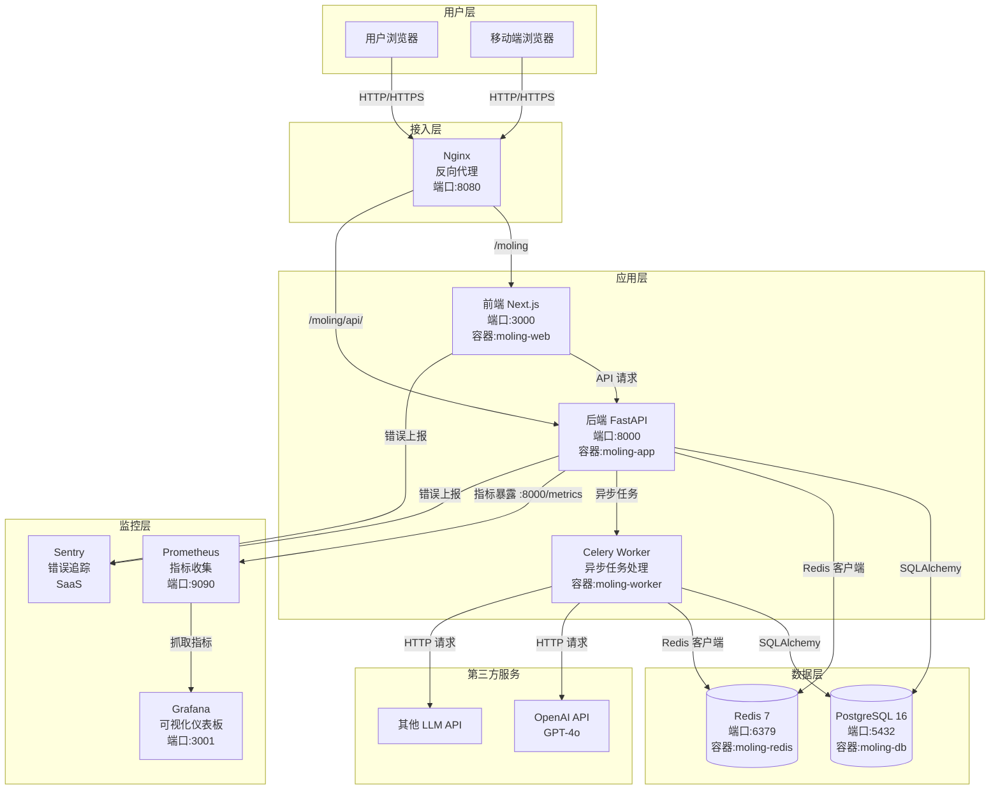
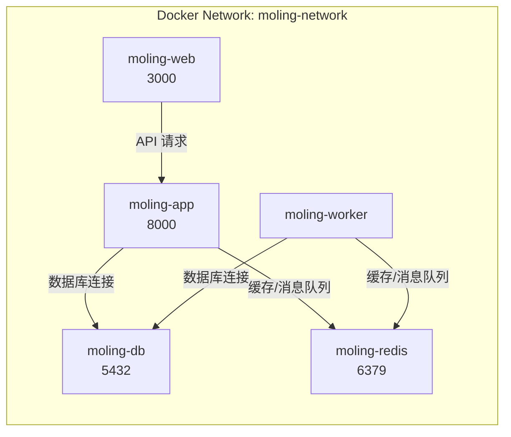
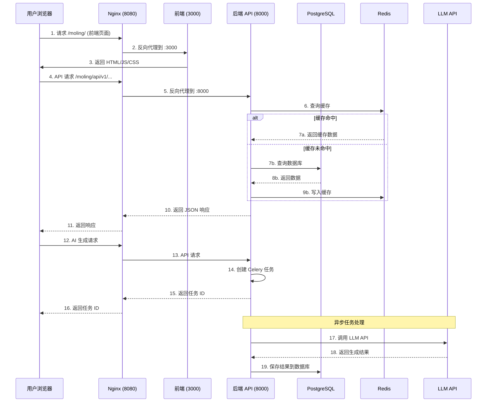
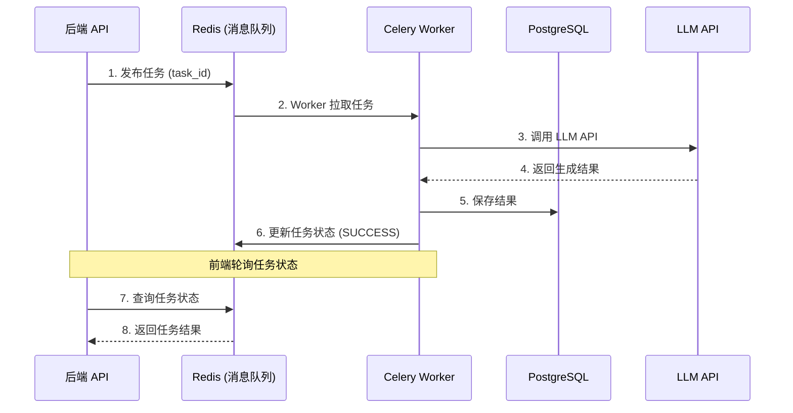
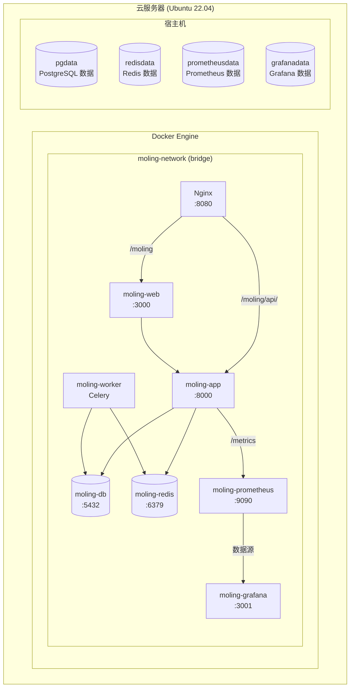
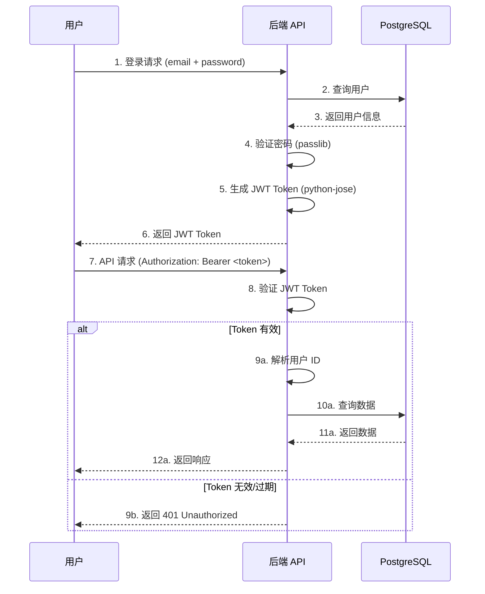

# 墨灵(Moling) 系统架构说明

> **文档版本**: 1.10.0  
> **最后更新**: 2026-06-21  
> **维护者**: Moling Team  
> **适用人员**: 开发人员、运维人员、架构师

---

## 目录

1. [系统概述](#系统概述)
2. [系统架构图](#系统架构图)
3. [数据流图](#数据流图)
4. [技术栈说明](#技术栈说明)
5. [部署架构](#部署架构)
6. [第三方服务](#第三方服务)
7. [目录结构](#目录结构)
8. [Phase 4 核心架构](#phase-4-核心架构)
9. [安全架构](#安全架构)

---

## 系统概述

**墨灵(Moling)** 是一个 AI 辅助小说创作平台，帮助用户通过 AI 能力进行小说创作、角色设定、情节设计等。

### 核心功能

- 📝 **小说创作**：提供 AI 辅助的小说写作功能
- 👤 **角色管理**：创建和管理小说角色
- 📚 **项目管理**：管理多个小说项目
- 🤖 **AI 生成**：基于 LLM 的内容生成（情节、对话、描述等）
- 📊 **知识库**：存储和管理创作素材

### 架构特点

- **前后端分离**：前端（Next.js）+ 后端（FastAPI）
- **容器化部署**：使用 Docker Compose 编排服务
- **异步任务处理**：使用 FastAPI BackgroundTasks 处理耗时任务（AI 生成），MVP 阶段用内存存储任务状态，后续可升级至 Celery + Redis
- **缓存优化**：使用 Redis 缓存热点数据
- **监控告警**：Prometheus + Grafana + Sentry

---

## 系统架构图

### 整体架构



### 网络拓扑



---

## 数据流图

### 用户请求流程



### 异步任务流程



---

## 技术栈说明

### 后端技术栈

| 技术 | 版本 | 用途 | 说明 |
|------|------|------|------|
| **Python** | >= 3.10 | 编程语言 | 后端主要开发语言 |
| **FastAPI** | >= 0.115.0 | Web 框架 | 高性能异步 Web 框架 |
| **Uvicorn** | >= 0.34.0 | ASGI 服务器 | FastAPI 的生产服务器 |
| **SQLAlchemy** | >= 2.0.36 | ORM | 异步数据库操作 |
| **Alembic** | >= 1.14.0 | 数据库迁移 | 管理数据库 schema 变更 |
| **PostgreSQL** | 16 | 关系数据库 | 主数据库（pgvector 扩展支持向量搜索） |
| **Redis** | 7 | 缓存/消息队列 | 缓存 + Celery 消息队列 |
| **Celery** | >= 5.5.0 | 异步任务 | 处理耗时任务（AI 生成等） |
| **Pydantic** | >= 2.10.0 | 数据验证 | 请求/响应数据验证 |
| **python-jose** | >= 3.3.0 | JWT 处理 | 用户认证和授权 |
| **passlib** | >= 1.7.4 | 密码哈希 | 用户密码加密 |
| **httpx** | >= 0.28.0 | HTTP 客户端 | 调用外部 API（LLM 等） |
| **structlog** | >= 24.4.0 | 结构化日志 | 统一的日志格式 |
| **tenacity** | >= 9.0.0 | 重试机制 | API 调用重试 |
| **prometheus-fastapi-instrumentator** | >= 7.0.0 | 指标收集 | 暴露 Prometheus 指标 |
| **sentry-sdk** | >= 2.0.0 | 错误追踪 | 实时监控和错误上报 |
| **slowapi** | >= 0.1.9 | 限流 | API 速率限制 |

### 前端技术栈

| 技术 | 版本 | 用途 | 说明 |
|------|------|------|------|
| **Node.js** | >= 18.0.0 | JavaScript 运行时 | 前端开发环境 |
| **Next.js** | ^15.1.0 | React 框架 | 前端主框架（App Router） |
| **React** | ^19.0.0 | UI 库 | 用户界面构建 |
| **TypeScript** | ^5.7.0 | 类型系统 | 类型安全开发 |
| **Zod** | ^4.4.3 | 数据验证 | 前端数据验证（配合 React Hook Form） |
| **Sentry** | ^10.58.0 | 错误追踪 | 前端错误监控 |
| **Playwright** | ^1.60.0 | E2E 测试 | 端到端测试 |
| **Vitest** | ^4.1.8 | 单元测试 | 单元测试框架 |

### 基础设施技术栈

| 技术 | 版本 | 用途 | 说明 |
|------|------|------|------|
| **Docker** | 20.10.0+ | 容器运行时 | 应用容器化 |
| **Docker Compose** | 2.0.0+ | 容器编排 | 多容器应用管理 |
| **Nginx** | 1.20+ | 反向代理 | 请求路由和负载均衡 |
| **Prometheus** | latest | 监控 | 指标收集和存储 |
| **Grafana** | latest | 可视化 | 监控仪表板 |
| **Sentry** | SaaS | 错误追踪 | 实时错误监控（云端服务） |

---

## 部署架构

### Docker Compose 两套编排

项目提供两套 Docker Compose 编排，适用于不同场景：

| 文件 | 用途 | 服务数 | 特点 |
|------|------|:------:|------|
| `./docker-compose.yml` | 开发 / 快速部署 | **4** | 仅核心服务（db, redis, app, web），端口全暴露，便于本地调试 |
| `./docker/docker-compose.yml` | 生产级完整编排 | **8** | 含 Nginx 反向代理、Celery Worker、Prometheus、Grafana；仅 Nginx 对外暴露端口，db/redis 仅内网可达 |

#### 1. 根目录 docker-compose.yml — 开发 / 快速部署

```yaml
# 启动: docker compose up -d --build
# 访问: http://localhost:3000（前端）| http://localhost:8000/docs（后端 API）

services:
  db:
    image: postgres:16-alpine
    container_name: moling-db
    ports: ["5432:5432"]

  redis:
    image: redis:7-alpine
    container_name: moling-redis
    ports: ["6379:6379"]
    command: redis-server --appendonly yes

  app:
    build: ./moling-server
    container_name: moling-app
    ports: ["8000:8000"]
    depends_on:
      db: { condition: service_healthy }
      redis: { condition: service_healthy }

  web:
    build: ./moling-web
    container_name: moling-web
    ports: ["3000:3000"]
    depends_on: [app]
```

#### 2. docker/docker-compose.yml — 生产级完整编排

```yaml
# 启动: docker compose -f docker/docker-compose.yml up -d --build
# 访问: http://localhost（前端 Nginx :80）| http://localhost/api/v1/docs（API 文档）

services:
  frontend:       # Nginx（前端 + API 反向代理）
    build: { context: ../moling-web, dockerfile: Dockerfile }
    container_name: moling-frontend
    ports: ["80:80", "443:443"]

  app:            # 后端 FastAPI（仅 expose，不暴露宿主机端口）
    build: { context: ../moling-server, dockerfile: Dockerfile }
    container_name: moling-api
    expose: ["8000"]

  worker:         # Celery Worker
    build: { context: ../moling-server, dockerfile: Dockerfile }
    container_name: moling-worker
    command: celery -A app.core.celery_app worker --loglevel=info

  db:             # PostgreSQL 17 + pgvector
    image: pgvector/pgvector:pg17
    container_name: moling-db
    # 生产环境不对外暴露端口（ports 注释掉）

  redis:          # Redis 7（带密码持久化）
    image: redis:7-alpine
    container_name: moling-redis
    # 生产环境不对外暴露端口（ports 注释掉）
    command: redis-server --appendonly yes --requirepass ${REDIS_PASSWORD}

  prometheus:     # 监控指标收集
    image: prom/prometheus:latest
    container_name: moling-prometheus
    ports: ["9090:9090"]

  grafana:        # 可视化仪表板
    image: grafana/grafana:latest
    container_name: moling-grafana
    ports: ["3001:3000"]    # 宿主机 3001 → 容器内 3000
```

> **提示**：两套编排使用相同的 Docker 网络名 `moling-network`，可在同一主机共存（注意端口冲突）。

### 部署架构图



### 端口映射

> **Docker 端口格式**：`"宿主机:容器"`（如 `"3001:3000"` 表示宿主机 3001 → 容器内 3000）

| 服务 | 容器内端口 | 宿主机端口 | Docker 映射 | 说明 |
|------|:----------:|:----------:|-------------|------|
| Nginx (frontend) | 80, 443 | 80, 443 | `80:80`, `443:443` | 反向代理入口（仅生产编排；根目录编排无此服务） |
| moling-web | 3000 | 3000 | `3000:3000` | 前端 Next.js |
| moling-app | 8000 | 8000 | `8000:8000` | 后端 FastAPI（开发编排暴露；生产编排仅 `expose` 内网可达） |
| moling-worker | — | — | 无端口 | Celery 异步任务 Worker（仅生产编排） |
| moling-db | 5432 | 5432 | `5432:5432` | PostgreSQL（开发编排暴露；生产编排注释掉 ports） |
| moling-redis | 6379 | 6379 | `6379:6379` | Redis（开发编排暴露；生产编排注释掉 ports） |
| Prometheus | 9090 | 9090 | `9090:9090` | 监控指标收集（仅生产编排） |
| Grafana | 3000 | 3001 | `3001:3000` | 可视化仪表板（仅生产编排；容器内 3000 → 宿主机 3001） |

> **安全建议**：生产环境中仅暴露 Nginx 端口（80/443），其他服务只在 Docker 网络内访问。根目录 `docker-compose.yml` 为开发便利暴露了所有端口，**切勿直接用于生产**。

---

## 第三方服务

### LLM API

| 服务 | 用途 | 配置项 | 说明 |
|------|------|--------|------|
| **OpenAI API** | AI 内容生成 | `OPENAI_API_KEY` | GPT-4o、GPT-4-turbo 等模型 |
| **其他 LLM** | 备用/成本优化 | `LLM_API_KEY`<br/>`LLM_BASE_URL` | 支持 OpenAI 兼容接口的其他 LLM |

**配置示例**：

```bash
# moling-server/.env
OPENAI_API_KEY=sk-...
OPENAI_BASE_URL=https://api.openai.com/v1

# 或者使用其他 LLM（如通义千问、文心一言等）
# LLM_API_KEY=sk-...
# LLM_BASE_URL=https://dashscope.aliyuncs.com/compatible-mode/v1
```

### Token 预算管理 (RF2.10)

> **状态**: ✅ 已实现 — 2026-06-21  
> **文件**: `app/llm/client.py` (TokenBudgetManager), `app/config.py` (TOKEN_BUDGET_LIMIT)

**功能**: 基于 Redis 持久化的 Token 用量追踪与预算控制，多 Worker 进程间共享预算状态。

| 特性 | 说明 |
|------|------|
| **持久化** | Redis Sorted Set (`moling:token_budget:*`) 按日分区 |
| **预算上限** | `TOKEN_BUDGET_LIMIT` 环境变量配置（默认 1,000,000 tokens/天） |
| **多用户** | 按 `user_id` 维度独立追踪 |
| **超限处理** | `_check_budget()` 前置检查，超限立即拒绝并返回 429 |
| **异步接口** | `track_usage()` / `check_budget()` / `get_budget_status()` 均为 `async` |
| **进程重启** | Redis 持久化确保数据不丢失 |

**Redis Key 格式**:
```
moling:token_budget:{user_id} → Sorted Set
  score: Unix timestamp
  member: {timestamp_ms}:{tokens}
```

**配置**:
```bash
# .env
TOKEN_BUDGET_LIMIT=1000000    # 默认 100 万 tokens/天
```

### Sentry (错误追踪)

| 项目 | 说明 |
|------|------|
| **Sentry Org** | moling |
| **Sentry Project (后端)** | moling-server |
| **Sentry Project (前端)** | moling-web |
| **配置项** | `SENTRY_DSN` |

**配置示例**：

```bash
# moling-server/.env
SENTRY_DSN=https://xxx@xxx.ingest.sentry.io/xxx

# moling-web/.env.local
NEXT_PUBLIC_SENTRY_DSN=https://xxx@xxx.ingest.sentry.io/xxx
```

**访问地址**：
- 后端项目：https://sentry.io/organizations/moling/issues/
- 前端项目：https://sentry.io/organizations/moling/issues/

### pgBackRest (数据库备份)

> **注意**：当前项目尚未配置 pgBackRest，以下是推荐配置。

| 功能 | 说明 |
|------|------|
| **全量备份** | 每周一次 |
| **增量备份** | 每天一次 |
| **归档备份** | WAL 日志归档 |
| **远程存储** | 支持 S3、Azure、GCS 等 |

**推荐配置**：

```bash
# 安装 pgBackRest
sudo apt-get install pgbackrest

# 配置 /etc/pgbackrest.conf
[moling]
pg1-path=/var/lib/postgresql/data
backup-path=/var/backups/pgbackrest
backup-user=postgres
log-path=/var/log/pgbackrest

# 创建备份定时任务
0 2 * * * pgbackrest --stanza=moling backup
```

---

## 目录结构

### 项目根目录

```
MolingProject/
├── moling-server/              # 后端项目
│   ├── app/                   # 应用代码
│   │   ├── api/               # API 路由
│   │   ├── core/              # 核心配置（数据库、Redis、Celery 等）
│   │   ├── models/            # SQLAlchemy 模型
│   │   ├── schemas/           # Pydantic schemas
│   │   └── services/          # 业务逻辑
│   ├── alembic/               # 数据库迁移脚本
│   ├── tests/                 # 单元测试
│   ├── .env                   # 环境变量（不提交到 Git）
│   ├── .env.example           # 环境变量模板
│   ├── Dockerfile             # 后端 Dockerfile
│   ├── pyproject.toml        # Python 项目配置
│   └── README.md              # 后端说明文档
├── moling-web/                # 前端项目
│   ├── src/                   # 源代码
│   │   ├── app/               # Next.js App Router
│   │   ├── components/        # React 组件
│   │   ├── lib/               # 工具函数
│   │   └── types/             # TypeScript 类型定义
│   ├── public/                # 静态资源
│   ├── .env.local             # 本地环境变量（不提交到 Git）
│   ├── .env.production        # 生产环境变量
│   ├── Dockerfile             # 前端 Dockerfile
│   ├── next.config.ts         # Next.js 配置
│   ├── package.json           # npm 依赖
│   └── README.md              # 前端说明文档
├── docker/                    # Docker 配置
│   ├── docker-compose.yml     # Docker Compose 配置
│   ├── nginx/                 # Nginx 配置
│   │   ├── nginx.conf         # Nginx 主配置
│   │   └── ssl/              # SSL 证书
│   ├── prometheus.yml         # Prometheus 配置
│   ├── grafana/              # Grafana 配置
│   │   └── provisioning/     # 预配置仪表板
│   ├── deploy.sh              # Linux 部署脚本
│   └── DEPLOYMENT.md         # 部署文档
├── docs/                      # 项目文档
│   ├── README.md              # 文档索引
│   ├── ARCHITECTURE.md        # 系统架构（本文档）
│   ├── SPECIFICATIONS.md      # 功能规格
│   ├── DEPLOYMENT.md          # 部署指南
│   ├── SECURITY_HARDENING.md  # 安全加固
│   ├── ONBOARDING.md          # 开发上手
│   ├── design/                # 设计文档
│   ├── operations/            # 运维手册（RUNBOOK/备份/监控/CI/CD）
│   ├── reports/               # 审计报告
│   ├── guides/                # 开发指南
│   └── archive/               # 历史归档
├── .github/                   # GitHub 配置
│   └── workflows/             # CI/CD 流水线
│       ├── ci-cd.yml         # CI/CD 配置
│       └── backup-test.yml   # 备份测试
├── .env                       # 根目录环境变量（可选）
├── docker-compose.yml         # 根目录 Docker Compose（简化版）
├── README.md                  # 项目说明
└── PRD_墨灵MVP.md            # 产品需求文档
```

---

## Phase 4 核心架构

### 状态机

Phase 4 是墨灵的核心流水线：从 LLM 提取章节变更 → 逐库合并 → 事务提交。完整状态定义如下：

```
IDLE → QUEUED → LOCKING → EXTRACTING → VERIFYING → MERGING → COMMITTING → DONE
                 ↓           ↓            ↓          ↓         ↓
               RETRY       RETRY        RETRY      RETRY     FAILED
                 ↓
               ⏎ (回补到 QUEUED，最多 5 次)
                 5 次后 → FAILED
```

| 状态 | 说明 |
|------|------|
| `IDLE` | 初始状态，等待任务 |
| `QUEUED` | 已入队列 |
| `LOCKING` | 获取分布式锁 |
| `EXTRACTING` | 调用 LLM 提取变更 |
| `VERIFYING` | SourceText Grounding 验证（防幻觉） |
| `MERGING` | 四库合并（人物/时间线/承诺/世界观） |
| `COMMITTING` | 事务提交 |
| `DONE` | 完成 |
| `FAILED` | 失败（不可恢复） |
| `RETRY` | 可重试失败（指数退避） |

### 分布式锁

使用 Redis SET NX EX 实现项目级写锁，防止同一项目并发写入：

- **Key**: `phase4:lock:{project_id}`
- **TTL**: 30s（自动过期防死锁）
- **轮询策略**: 每 200ms 重试，最多 15 次（总超时 3s）
- **释放**: 仅锁持有者（通过 `scheduler_id` 验证）可释放

### 幂等性（三层防护）

| 层 | 范围 | 机制 |
|:--:|------|------|
| L1 | 内存 | in-memory nonce LRU 缓存（最多 1000 条） |
| L2 | 数据库 | `Phase4Task.nonce` UNIQUE 约束 |
| L3 | 业务 | 幂等键 `chapter_id + chapter_text_hash` |

### 失败回补

指数退避重试，防止瞬时故障导致任务失败：

| 重试次数 | 等待间隔 |
|:--------:|----------|
| 第 1 次 | 10s |
| 第 2 次 | 30s |
| 第 3 次 | 60s |
| 第 4 次 | 120s |
| 第 5 次 | 300s |
| 超过 5 次 | 标记 FAILED，通知用户 |

### 事务边界

```
LLM 调用（事务外，可重试，不浪费 token）
    ↓
savepoint ─ 四库合并写入
          ├─ 卡牌充实
          ├─ 卡牌淘汰
          └─ 变更日志
    ↓
savepoint 失败 → 回滚到 savepoint（保留 LLM 结果）
    ↓
db.commit() → 全部成功
```

详细规格见 `docs/SPECIFICATIONS.md`。

### Phase 4 已知技术债（扫描 v4，2026-06-21）

> **扫描范围**: 15 文件 ~9000 行 | **加权总分**: 71.5/100 (B 级)  
> **报告完整版**: `docs/reports/scan-v4-phase4.md`

#### Critical (P0 — 必须修复)

| ID | 问题 | 影响 | 位置 | 状态 |
|----|------|------|------|:--:|
| P2-2 | Redis 释放锁无 owner 验证 | 可能误删其他 Worker 持有的锁 | `phase4_store.py:107-108` | ✅ |
| P9-2 | R2 健康规则 `event_type` → `event` 字段名错误 | R2 告警永不被触发 | `health_monitor.py` | ✅ |
| P5-3 | `consecutive_failures` 全局共享受影响跨项目告警 | 项目 A 失败导致项目 B 收到错误告警 | `phase4_scheduler.py` | ✅ |
| P6-4 | stale 检查只看 `planted_chapter` 忽略 `advancement_log` | 已推进承诺被误标 stale | `merge_service.py:758,864` | ✅ |

#### High (P1 — 强烈建议)

| ID | 问题 | 影响 | 位置 |
|----|------|------|------|
| P1-3 | `state`(Phase4State enum) 与 `status`(str) 双状态系统：多处同时更新但可能不一致 | 状态查询不可靠 | `phase4_task.py` 模型 + `phase4_service.py` |
| P7-2 | 两套 LLM 提取体系：`execute_storage` 走 `_analyze_chapter_content`（旧版），`run_phase4` 走 `_call_extraction_llm`（新版） | 提取结果结构不一致，维护成本翻倍 | `phase4_service.py` |
| P11-1 | 导入引擎无 BulkInserter：章节创建逐条 `db.add()`，1000+ 章导入性能差 | 大型导入极慢 | `import_service.py:327-339` |
| P11-2 | 导入引擎无 savepoint 事务回滚保护：第 50/100 章失败时前 49 章状态不确定 | 数据安全风险 | `import_service.py` |

#### 修复优先级

```
P2-2 (锁安全) → P9-2 (R2 失效) → P5-3 (全局计数器)
    ↓
P11-1 → P11-2 (导入引擎) → P1-3 (双状态) → P7-2 (两套提取)
```

所有修复完成后目标分数：**85+/100 (A 级)**

---

## 安全架构

### Core/Middleware 已知技术债（扫描 v4，2026-06-21）

> **扫描范围**: core/ + middleware/ + 上下文文件 | **发现**: 4 CRITICAL, 6 HIGH, 7 MEDIUM, 12 LOW  
> **报告完整版**: `docs/reports/scan-v4-core.md`

#### Critical (P0)

| ID | 问题 | 位置 | 影响 |
|----|------|------|------|
| C1 | greenlet 补丁块中引用未定义的 `logger` — Windows 启动时 NameError | `dependencies.py:41,65` | Windows 应用完全不可用 | ✅ |
| C2 | 审计日志无条件 `await request.body()` — 全量缓冲至内存 | `audit_log.py:67-70` | OOM 攻击向量 |
| C3 | ResponseFormat 全量缓冲响应体 — 流式 SSE/文件下载不可用 | `response_format.py:46-61` | 文件下载 OOM，SSE 完全不可用 |
| C4 | 纯内存限流 — 多 Worker 独立计数 | `rate_limit.py:38-39` | 限流形同虚设（实际=配置×worker数） |

#### High (P1)

| ID | 问题 | 位置 | 影响 |
|----|------|------|------|
| H1 | 审计日志敏感数据过滤仅检查 query string | `audit_log.py:161` | Token/API Key 明文泄露到日志 |
| H2 | 日志路径/轮转/保留全部硬编码 | `audit_log.py:15-55` | 运维不可控 |
| H3 | 审计日志仅按时间轮转无大小保护 | `audit_log.py:31` | 磁盘写满风险 |
| H4 | Content-Length limit 与 config 脱节 | `content_length_limit.py:16` vs `main.py:166` | 修改配置不生效 |
| H5 | SECRET_KEY validator 依赖 Pydantic 字段声明顺序 | `config.py:174-177` | 生产可能用弱密钥 | ✅ |
| H6 | PostgreSQL 连接池缺 pool_recycle/pool_pre_ping | `dependencies.py:127-132` | 空闲连接过期异常 | ✅ |

#### 修复优先级

```
C1 (Windows 崩溃) → C2/C3 (OOM) → C4 (限流)
    ↓
H1 (敏感数据) → H5 (弱密钥) → H6 (连接池) → H2-H4 (运维化)
```

### 认证安全已知技术债（扫描 v4，2026-06-21）

> **扫描范围**: config.py/auth_service.py/blacklist.py/dependencies.py | **发现**: 3 P0, 3 P1  
> **报告完整版**: `docs/reports/scan-v4-security.md`

#### P0 (立即修复)

| ID | 问题 | 位置 | 影响 | 状态 |
|----|------|------|------|:--:|
| S1 | Access Token 硬编码 `timedelta(minutes=15)` 忽视 `ACCESS_TOKEN_EXPIRE_MINUTES` 配置 | `auth_service.py:52` | 配置修改不生效，Token 过期时间不可控 | ✅ |
| S2 | Refresh Token 硬编码 `timedelta(days=30)` 忽视 `REFRESH_TOKEN_EXPIRE_DAYS=7` 配置 | `auth_service.py:67` | 实际有效期是配置的 4 倍，扩大泄露窗口 | ✅ |
| S3 | 密码策略不足：无账户锁定、无复杂度要求（允许 `12345678`）、无密码历史、无强度检查 | `auth_service.py` | 暴力破解风险 + 弱密码风险 |

#### P1 (尽快修复)

| ID | 问题 | 位置 | 影响 |
|----|------|------|------|
| S4 | 黑名单降级策略：Redis 不可用时 `is_blacklisted()` 返回 False | `auth/blacklist.py` | 所有已登出 Token 仍然有效 | ✅ |
| S5 | RBAC 不成熟：`status` 字段既是账户状态又是角色 | `models/user.py` | 权限模型脆弱，无法扩展 |
| S6 | python-jose 维护停滞（最后更新 2021） | `dependencies.py` | 建议迁移 PyJWT |

#### 修复优先级

```
S1/S2 (Token 过期) → S3 (密码策略) → S4 (黑名单降级) → S5 (RBAC) → S6 (jose→PyJWT)
```

### LLM 集成深度修复（扫描 v4，2026-06-21）

> **扫描范围**: `app/llm/` 6 文件（client.py/key_manager.py/context_budget.py/prompts.py） | **发现**: 2 CRITICAL, 2 HIGH, 4 MEDIUM  
> **报告完整版**: `docs/reports/scan-v4-llm.md`  
> **全部修复时间**: 2026-06-21 03:30

| ID | 严重度 | 问题 | 位置 | 影响 | 状态 |
|----|:--:|------|------|------|:--:|
| L1 | CRITICAL | Token 预算绕过：`_chat_stream` 流式请求不调用 `budget_manager.record_usage()` | `client.py:579` | 流式请求 Token 完全不记入预算 | ✅ |
| L2 | CRITICAL | `ContextBudget` 完整实现但 LLMClient 从未调用 | `context_budget.py` | Prompt 可能超过模型上下文窗口 | ✅ |
| L3 | HIGH | KeyManager `_recover_key` 后 backoff_level 不重置 | `key_manager.py` | 已恢复 Key 下次瞬时错误直接进 300s 冷却 | ✅ |
| L4 | HIGH | `get_effective_llm_config()` 硬编码 default，永远不读 `LLM_MODEL` | `config.py:263` | 配置修改不生效 | ✅ |
| M1 | MEDIUM | `prompts.py` 中 Prompt 模板无版本号管理 | `prompts.py` | 迭代时难以追溯变更 | ⬜ |
| M2 | MEDIUM | 缺少 LLM 响应 schema validation | `client.py` | 格式错误静默传播 | ⬜ |
| M3 | MEDIUM | 流式响应无 timeout 超时处理 | `client.py` | 长连接无保护 | ⬜ |
| M4 | MEDIUM | KeyManager 缺少 key 级别的并发锁 | `key_manager.py` | 高并发下可能重复选 key | ⬜ |

**修复详情**:
- **L1** (`client.py:584`): 流式路径新增 `budget_manager.record_usage()` + `report_success()`
- **L2** (`client.py`): `__init__` 中初始化 `ContextBudget` 实例，`chat()` 中调用 `check()` 做上下文窗口监测
- **L3** (`key_manager.py:257`): `_recover_key()` 中 `health.backoff_level = 0`
- **L4** (`config.py:263`): `get_effective_llm_config()` 正确读取 `_OVERRIDES.get("llm_model") or s.LLM_MODEL`

---

## 安全架构 (继续)

### 配置管理

> **新增于 2026-06-21 R3 架构加固**

所有运行时配置通过 `app/config.py` Settings 类统一管理，支持环境变量 + `.env` 文件 + 数据库运行时覆写三层优先级。

| 配置项 | 环境变量 | 默认值 | 用途 |
|--------|---------|--------|------|
| `DATABASE_URL` | `DATABASE_URL` | `sqlite+aiosqlite:///./moling.db` | 数据库连接串 |
| `REDIS_URL` | `REDIS_URL` | `redis://localhost:6379/0` | Redis 连接串 |
| `REDIS_PASSWORD` | `REDIS_PASSWORD` | `None` | Redis 密码 |
| `SECRET_KEY` | `SECRET_KEY` | (dev default, 生产强制覆盖) | JWT 签名密钥 |
| `ACCESS_TOKEN_EXPIRE_MINUTES` | `ACCESS_TOKEN_EXPIRE_MINUTES` | `15` | Access Token 过期时间（分钟） |
| `REFRESH_TOKEN_EXPIRE_DAYS` | `REFRESH_TOKEN_EXPIRE_DAYS` | `7` | Refresh Token 过期时间（天） |
| `LLM_API_BASE` | `LLM_API_BASE` | `https://api.deepseek.com` | LLM API 地址 |
| `LLM_API_KEY` | `LLM_API_KEY` | (placeholder) | LLM API 密钥 |
| `LLM_MODEL` | `LLM_MODEL` | `gpt-4o-mini` | 默认 LLM 模型 |
| `CELERY_BROKER_URL` | `CELERY_BROKER_URL` | `redis://localhost:6379/1` | Celery 消息代理 |
| `CELERY_RESULT_BACKEND` | `CELERY_RESULT_BACKEND` | `redis://localhost:6379/2` | Celery 结果后端 |
| `CORS_ORIGINS` | `CORS_ORIGINS` | `localhost:3000,5173` | 允许的跨域来源 |
| `MAX_BODY_SIZE` | `MAX_BODY_SIZE` | `10MB` | 最大请求体大小 |
| `RATE_LIMIT_CALLS` | `RATE_LIMIT_CALLS` | `1000` | 限流周期内最大请求数 |
| `RATE_LIMIT_PERIOD` | `RATE_LIMIT_PERIOD` | `60` | 限流周期（秒） |
| `LLM_PRO_KEYS` | `LLM_PRO_KEYS` | `[]` | Pro API Key 池（逗号分隔） |
| `LLM_FLASH_KEYS` | `LLM_FLASH_KEYS` | `[]` | Flash API Key 池（逗号分隔） |
| `KEY_SELECT_STRATEGY` | `KEY_SELECT_STRATEGY` | `LEAST_USAGE` | Key 选择策略 |
| `KEY_BACKOFF_BASE` | `KEY_BACKOFF_BASE` | `30` | Key 冷却基础秒数 |
| `KEY_BACKOFF_MAX` | `KEY_BACKOFF_MAX` | `300` | Key 冷却最大秒数 |
| `ARCHIVE_DIR` | `ARCHIVE_DIR` | `./archives` | 动态层存档目录 |
| `SENTRY_DSN` | `SENTRY_DSN` | `None` | Sentry 错误追踪 DSN |
| `ENVIRONMENT` | `ENVIRONMENT` | `development` | 运行环境 |

**配置优先级**: 数据库运行时覆写 > 环境变量 > `.env` 文件 > 代码默认值

**安全验证器**:
- 生产环境 `SECRET_KEY` 不能使用默认值 → 启动时拒绝
- 生产环境 `CORS_ORIGINS` 包含 `*` → 警告
- `LLM_API_KEY` 为 placeholder → 警告
- `REDIS_PASSWORD` 未设置（非 dev）→ 警告
- `DATABASE_URL` 包含弱密码 → 警告

### Celery Beat 定时调度

> **新增于 2026-06-21 R3 架构加固**

4 个周期性任务通过 Celery Beat 自动执行，无需外部 cron 触发：

| 任务 | 调度周期 | 队列 | 用途 |
|------|---------|------|------|
| `phase4-auto-advance` | 每小时 | default | 扫描自动审核项目，触发 Phase 4 分析 |
| `vault-periodic-reanalyze` | 每 6 小时 | default | 对近期活跃项目触发 Vault 重分析 |
| `card-retire-check` | 每天 | default | 检查卡片池新鲜度，标记过期卡片 |
| `health-auto-notify` | 每 30 分钟 | default | 活跃项目健康检查，生成 HealthAlert |

**启动命令**:
```bash
# Worker（处理任务）
celery -A app.worker.celery_app worker -Q default,llm --loglevel=info

# Beat（定时调度）
celery -A app.worker.celery_app beat --loglevel=info

# 或合并运行（开发环境）
celery -A app.worker.celery_app worker -B -Q default,llm --loglevel=info
```

### 健康检查

> **更新于 2026-06-21 R3 架构加固**

`GET /api/v1/health` 端点验证三方依赖连通性：

| 检查项 | 方法 | 超时 |
|--------|------|------|
| **Database** | `SELECT 1` | 继承 db session 超时 |
| **Redis** | `PING` | 3s 连接超时 |
| **Celery** | `control.ping()` | 3s 超时 |

返回状态：`ok`（全部通过）或 `degraded`（任一失败）。`degraded` 时 `message` 字段列出失败的依赖。

### 子情节健康监控服务

> **新增于 2026-06-21 R1+R2 架构加固**

`app/service/health_monitor.py` 对活跃项目的剧情承诺（plot promises）执行三级预警检测，**纯算法/SQL 实现，零 LLM 成本**：

| 级别 | 触发条件 | 严重程度 | 行为 |
|:----:|----------|:--------:|------|
| **R1 (黄)** | 连续 8 章无对应 promise 推进 | 🟡 低 | 生成 HealthAlert，通知用户关注 |
| **R2 (橙)** | 连续 4+ 次同类型 promise 重复推进 | 🟠 中 | 生成 HealthAlert + 建议 plot 结构调整 |
| **R3 (红)** | 连续 10 章静默（promise 完全无提及） | 🔴 高 | 先检查最新章节关键词提及 → 若提及则**降级为 R1**；若无提及则生成严重告警 |

**防疲劳过滤**: 同一 `(promise_id, rule)` 组合在 3 章内最多触发 1 次，防止重复扰民。

**章级增量算法**: 每次检测只对比当前章节与历史推进记录，不重新分析全部历史章节——时间复杂度 O(1) 而非 O(n)。

### AppError 错误处理体系

> **新增于 2026-06-21 R1+R2 架构加固**

统一错误处理取代散落的 `HTTPException` 直接抛出：

| 层 | 组件 | 说明 |
|:--:|------|------|
| **枚举** | `ErrorCode` (IntEnum) | 数字编码 = `HTTP状态码 × 100 + 序号`（如 `40101`, `50001`），机器可读 |
| **消息** | `_ERROR_MESSAGES` 字典 | 每个 ErrorCode 对应中文可读消息 |
| **映射** | `_ERROR_TO_STATUS` 字典 | ErrorCode → HTTP 状态码自动映射 |
| **基类** | `AppError(HTTPException)` | 统一基类，接收 `ErrorCode` + 可选 `detail` 覆盖消息 |
| **子类** | `NotFoundError`, `AuthError`, `PermissionError`, `ValidationError`, `RateLimitError`, `ConflictError`, `VaultNotFoundError` | 语义化子类，方便 try/except 精确捕获 |

**调用契约**:
```python
# 旧: raise HTTPException(status_code=404, detail="项目不存在")
# 新: raise NotFoundError(ErrorCode.PROJECT_NOT_FOUND)
# 需要附加信息时:
raise NotFoundError(ErrorCode.PROJECT_NOT_FOUND, detail=f"项目 {project_id} 已被删除")
```

**全局异常处理器** (`app/main.py`): 捕获所有 `AppError` 子类，统一格式化为 `{"code": 40101, "message": "...", "data": null}` 响应，并自动调用 `_write_error_log()` 记录结构化日志。

### Content-Length 请求体限制

> **新增于 2026-06-21 R1+R2 架构加固**

`app/middleware/content_length_limit.py` 在 ASGI 层前置拦截超大请求体，**在读取 body 之前**就根据 `Content-Length` 头拒绝，防止内存攻击：

| 配置项 | 默认值 | 说明 |
|--------|--------|------|
| `DEFAULT_MAX_SIZE` | 10MB (`10 * 1024 * 1024`) | 默认最大请求体大小 |
| `excluded_paths` | `("/api/v1/import/upload",)` | 排除路径（如文件上传需要更大尺寸） |

413 响应格式: `{"code": 41301, "message": "请求体过大", "data": null, "meta": {"max_size": 10485760, "request_id": "..."}}`

### Worker 可靠性链路

> **新增于 2026-06-21 R1+R2 架构加固**

Celery Worker 配置 (`app/worker/celery_app.py`) 经过 7 项生产级加固：

| 加固项 | 配置 | 作用 |
|--------|------|------|
| **超时控制** | `task_time_limit=600` (硬), `task_soft_time_limit=540` (软) | 防止任务永久挂起；软超时可捕获 `SoftTimeLimitExceeded` 做清理 |
| **延迟确认** | `task_acks_late=True` | 任务完成后才确认，worker 崩溃不丢任务 |
| **预取控制** | `worker_prefetch_multiplier=1` | 每次只取 1 个任务，防止长任务堆积 |
| **队列分离** | `llm` (长任务) vs `default` (短任务) | 通过 `task_routes` 路由，LLM 任务不阻塞常规任务 |
| **故障恢复** | `task_reject_on_worker_lost=True` + `visibility_timeout=3600` | 1 小时未确认则重新入队 |
| **内存泄漏防护** | `worker_max_tasks_per_child=50` | 每 50 个任务重启子进程，释放积累内存 |
| **序列化安全** | `task_serializer='json'` | 使用 JSON 而非 pickle，防止反序列化攻击 |

**Worker DB 会话管理模式** (`app/worker/db.py`):
- **统一入口**: 所有 6 个 Worker 通过 `get_worker_session()` 获取 DB 会话，禁止各自创建引擎
- **惰性创建**: 引擎在首次请求时才创建 (`_ensure_engine()`)，`pool_size=2` + `pool_pre_ping=True`
- **优雅释放**: 通过 Celery `worker_shutdown` 信号触发 `dispose_worker_engine()` 释放连接池

**三层异常处理** (以 `phase4_task.py` 为例，6 个 Worker 统一模式):
```
SoftTimeLimitExceeded → 重新投递 (raise)
    ↓
可重试异常 (SQLAlchemyError, ConnectionError, TimeoutError) → autoretry_for 自动重试
    ↓
通用 Exception → 记录日志，标记任务 FAILED
```

### Windows 平台适配

> **新增于 2026-06-21 R1+R2 架构加固**

`app/dependencies.py` 包含完整的 Windows 平台兼容层，解决 SQLAlchemy async + aiosqlite + greenlet 在 Windows 上的兼容问题：

| 适配项 | 实现 | 原理 |
|--------|------|------|
| **greenlet 猴子补丁** | 在 SQLAlchemy 导入前替换 `greenlet_spawn` → `ThreadPoolExecutor` | Windows 缺少原生 greenlet 支持 |
| **同步包装器** | `_SyncAsyncSessionWrapper` | 将同步 Session 包装为可 await 的异步接口 |
| **事件系统补丁** | 替换 `_get_exec_once_mutex` (返回 None) → `contextlib.nullcontext()` | SQLAlchemy 事件系统在 Windows 上的已知 bug |
| **双轨会话** | `get_db` (异步，Linux) + `get_sync_db` (同步，auth 场景) | auth 依赖完全避开 greenlet 问题 |

> **注意**: 这些适配仅影响 Windows 开发环境，Linux 生产环境走原生 async Session，无性能损失。

### 认证和授权



### 安全措施

| 措施 | 说明 | 配置位置 |
|------|------|----------|
| **HTTPS** | 使用 SSL 证书加密传输 | Nginx 配置 |
| **JWT 认证** | 无状态认证，Token 有效期 30 天 | `moling-server/app/core/security.py` |
| **密码哈希** | 使用 bcrypt 加密密码 | `passlib` |
| **CORS 配置** | 限制跨域请求来源 | `moling-server/app/main.py` |
| **Rate Limiting** | API 速率限制（防止滥用） | `slowapi` |
| **输入验证** | 使用 Pydantic 验证请求数据 | `moling-server/app/schemas/` |
| **SQL 注入防护** | 使用 SQLAlchemy ORM（自动转义） | `SQLAlchemy` |
| **XSS 防护** | React 自动转义 + CSP 头 | Next.js |
| **Sentry 监控** | 实时错误监控和告警 | `Sentry SDK` |
| **请求体限制** | ASGI 层 Content-Length 前置拦截（10MB） | `app/middleware/content_length_limit.py` |
| **请求体验证** | Pydantic + AppError 统一错误格式 | `app/errors.py`, `app/schemas/` |

### Refresh Token 轮换

> **新增于 2026-06-21 R1 架构加固**

登录接口返回 `access_token` + `refresh_token`，`POST /api/v1/auth/refresh` 端点实现轮换逻辑：
- 验证 refresh token → 签发新 access token + 新 refresh token
- 旧 refresh token 加入 Redis 黑名单（TTL = 原过期时间）
- 防止 refresh token 泄露后的长期滥用

---

## DAO 层设计规范

> **新增于 2026-06-21 R1+R2+R3 架构加固**

`app/dao/base_dao.py` 定义了所有 DAO 子类的统一行为规范：

| 规范 | 实现 | 目的 |
|------|------|------|
| **泛型基类** | `BaseDAO[ModelT]` | 所有 13 个 DAO 子类继承，类型安全 |
| **limit 钳制** | `DEFAULT_MAX_LIMIT = 500` / `_CURSOR_MAX_LIMIT = 200` | 防止 `?limit=999999` 拖垮数据库 |
| **软删除约定** | `include_deleted=False` 默认过滤，6 个 DAO 24 处 `is_deleted=False` | 数据可恢复，符合数据保护要求 |
| **游标分页** | `list_cursor(cursor, cursor_field, limit)` 返回 `(items, next_cursor)` | 替代 offset/limit，避免翻页数据重复/遗漏 |
| **统一异常处理** | 每个方法 `try/except SQLAlchemyError → AppError(ErrorCode.INTERNAL_ERROR)` | 异常类型统一，调用方可精确捕获 |
| **事务契约** | DAO 只执行 `flush()` + `refresh()`，**禁止内部 `commit()`** | 事务边界由 Service/Router 层控制 |

**方法契约清单** (13 个 DAO 统一实现):

| 方法 | 返回类型 | 说明 |
|------|---------|------|
| `create(data)` | `ModelT` | 创建并 flush+refresh |
| `get_by_id(id)` | `ModelT \| None` | 主键查询，默认排除软删除 |
| `get_multi(filters, limit, offset)` | `list[ModelT]` | 批量查询，limit 钳制 ≤500 |
| `update(id, data)` | `ModelT` | 部分更新，flush+refresh |
| `delete(id, soft=True)` | `ModelT` | 软删除（设置 is_deleted=True）或物理删除 |
| `restore(id)` | `ModelT` | 恢复软删除记录 |
| `count(filters)` | `int` | 计数，默认排除软删除 |
| `list_cursor(cursor, cursor_field, limit)` | `tuple[list, cursor]` | 游标分页查询 |

### Model 层时间戳统一 (TimestampMixin)

> **更新于 2026-06-21 — SystemConfig 迁移**

`app/models/mixins.py` 定义了 `TimestampMixin`，为所有模型提供统一的 `created_at` / `updated_at` 字段管理：

- `created_at`: `DateTime(UTC, default=func.now(), nullable=False)` — 记录创建时自动填充
- `updated_at`: `DateTime(UTC, default=func.now(), onupdate=func.now(), nullable=False)` — 每次更新自动刷新

**SystemConfig 迁移**：`app/models/system_config.py` 的原 `SystemConfig` 模型手动管理 `updated_at` 字段。现已重构为继承 `TimestampMixin`，移除手动 `updated_at` 逻辑，新增 `created_at`。

**Alembic 迁移**：`alembic/versions/0005_add_system_config_created_at.py` 为 `system_config` 表新增 `created_at` 列。

此变更是统一模型基础设施的第一步，后续所有模型应逐步迁移到 `TimestampMixin`。

### Schema 层 UUID 类型修正

> **更新于 2026-06-21 — vault Response Schema 修复**

`app/schemas/vault.py` 的 `CharacterResp.id` 和 `PlotPromiseResp.id` 字段原定义为 `int`，但底层 BaseModel 主键为 `String(36)` UUID。修正为 `str` 以匹配 ORM 类型。

`app/router/vault.py` 的路由参数 `character_id` 同步从 `int` 改为 `str`，保持路径参数与 Schema 类型一致。

此修复属于 ID 类型统一计划（见 `docs/id-type-unification-plan.md`）的战术执行，消除了 Schema 层与 ORM 层的类型不一致。

---

## 性能优化

### 后端性能优化

| 优化项 | 说明 | 配置位置 |
|--------|------|----------|
| **异步框架** | FastAPI + Uvicorn (async/await) | `moling-server/app/main.py` |
| **数据库连接池** | SQLAlchemy 连接池复用 | `moling-server/app/core/database.py` |
| **Redis 缓存** | 缓存热点数据（用户信息、配置等） | `moling-server/app/core/redis.py` |
| **Prometheus 指标** | 监控 API 响应时间、请求数等 | `prometheus-fastapi-instrumentator` |
| **Gzip 压缩** | 压缩响应体 | Nginx 配置 |

### 前端性能优化

| 优化项 | 说明 | 配置位置 |
|--------|------|----------|
| **Next.js Standalone** | 减小 Docker 镜像体积 | `next.config.ts` |
| **Static Generation** | 静态页面预渲染 | Next.js App Router |
| **Image Optimization** | 图片优化（暂时禁用，见 `next.config.ts`） | `next.config.ts` |
| **Code Splitting** | 按需加载 JS/CSS | Next.js 自动处理 |
| **HTTP Keep-Alive** | 复用 TCP 连接 | `next.config.ts` |

---

## 监控和告警

### 监控指标

| 指标 | 来源 | 说明 |
|------|------|------|
| **API 请求数** | Prometheus | 统计每个 API 端点的请求数 |
| **API 响应时间** | Prometheus | P95、P99 响应时间 |
| **错误率** | Sentry | API 500 错误、前端 JS 错误 |
| **数据库连接数** | PostgreSQL | 当前活跃连接数 |
| **Redis 内存使用** | Redis | Redis 内存占用 |
| **容器资源使用** | Docker | CPU、内存、网络、磁盘 |

### 告警规则

| 告警项 | 阈值 | 严重级别 | 通知方式 |
|--------|------|----------|----------|
| **API 500 错误** | > 5 个/分钟 | 🔴 高 | Sentry + 邮件 |
| **API 响应时间** | P99 > 5 秒 | 🟡 中 | Sentry + Slack |
| **数据库连接数** | > 80% 最大连接数 | 🟡 中 | 邮件 |
| **Redis 内存使用** | > 80% 最大内存 | 🟡 中 | 邮件 |
| **磁盘空间** | > 80% 使用率 | 🟡 中 | 邮件 |
| **Celery 任务失败** | > 10 个/小时 | 🟡 中 | Sentry |

---

## 附录

### A. 参考文档

- [FastAPI 官方文档](https://fastapi.tiangolo.com/)
- [Next.js 官方文档](https://nextjs.org/docs)
- [PostgreSQL 官方文档](https://www.postgresql.org/docs/)
- [Redis 官方文档](https://redis.io/docs/)
- [Docker 官方文档](https://docs.docker.com/)
- [Prometheus 官方文档](https://prometheus.io/docs/)
- [Grafana 官方文档](https://grafana.com/docs/)
- [Sentry 官方文档](https://docs.sentry.io/)

### C. 常用操作命令

#### 本地开发快速启动

```bash
# 1. 后端
cd moling-server
cp .env.example .env  # 编辑 .env，参照下节
uvicorn app.main:app --reload --host 0.0.0.0 --port 8000

# 2. 前端
cd moling-web
npm install && npm run dev

# 3. Celery（另一个终端）
cd moling-server
celery -A app.worker.celery_app worker -Q default,llm --loglevel=info
celery -A app.worker.celery_app beat --loglevel=info
```

#### .env 完整示例（14 变量）

```bash
DATABASE_URL=sqlite+aiosqlite:///./moling.db
SECRET_KEY=$(openssl rand -hex 32)
ENVIRONMENT=development
APP_VERSION=0.1.0
CORS_ORIGINS=http://localhost:3000

REDIS_URL=redis://localhost:6379/0
CELERY_BROKER_URL=redis://localhost:6379/1
CELERY_RESULT_BACKEND=redis://localhost:6379/2
# REDIS_PASSWORD=          # 生产必须设置

LLM_MODEL=deepseek-chat
LLM_PROVIDER=deepseek
LLM_API_KEY=sk-xxx
LLM_BASE_URL=https://api.deepseek.com/v1
# LLM_PRO_KEYS=sk-k1,sk-k2  # Pro Pool
# LLM_FLASH_KEYS=sk-f1,sk-f2 # Flash Pool

MAX_BODY_SIZE=10485760
# SENTRY_DSN=              # 可选
```

#### 健康检查

```bash
curl http://localhost:8000/api/v1/health
# → {"status":"ok","database":"ok","redis":"ok","celery":"ok"}
# 降级: {"status":"degraded","message":"redis,celery unreachable",...}
```

#### Redis / Celery 诊断

```bash
# Redis（无密码）
redis-cli ping
# Redis（有密码）
redis-cli -a "$REDIS_PASSWORD" ping

# Celery Worker 状态
celery -A app.worker.celery_app inspect ping
celery -A app.worker.celery_app inspect active
celery -A app.worker.celery_app inspect reserved

# Celery Beat 调度状态
celery -A app.worker.celery_app inspect conf | grep beat_schedule
```

#### Docker 部署（生产）

```bash
docker compose -f docker/docker-compose.yml up -d --build
docker compose -f docker/docker-compose.yml ps
docker compose -f docker/docker-compose.yml logs -f app worker
```

#### 数据库备份

```bash
docker exec moling-db pg_dump -U moling moling > backup_$(date +%Y%m%d).sql
```

### D. 文档版本历史

| 版本 | 日期 | 变更内容 | 作者 |
|------|------|----------|------|
| 1.10.0 | 2026-06-21 | 🛠 全体 7 模块深度修复闭环 — CRITICAL: phase4_service/chapter_service 静默吞异常→logger.error, client.py 完整重试+Key轮换+Token计数统一, genre/__init__.py 删print调试; Service: 新建 service_helpers.py 抽取共享工具, template/card_pool/setting/vault 全量事务保护, card_service PermissionError→AppError; Router+DAO+Model: genre.py HTTPException→AppError, phase4_dao/template_dao 添加 is_deleted 过滤, 24端点 response_model Schema化, router/__init__.py 移除重复generation路由; Worker: card_retire/book_analysis/import/phase4 四模块10+任务全量幂等保护; Ingest+Genre+Schema: ingest 10端点 response_model Schema化, Genre LLM超时+重试, scraper依赖合并到项目根, secret Schema Field描述补齐; Frontend: 8个error.tsx错误边界, Mock数据文件创建, settings去"use client"; Infra: docker-compose.prod.yml 端口/env_file修复, CI合并+版本对齐, Nginx安全头统一 | Moling Team |
| 1.7.0 | 2026-06-21 | 🛠 架构加固 Batch 5-7 — 扫描 v4: Phase4(P2-2/P9-2/P5-3/P6-4) + Core(C1/H5/H6) + Auth(S1/S2/S4) + LLM(L1/L3/L4); RF3.4: IngestJob FK + 6 Schema类型修正。共 15 项修复，14 文件变更 | Moling Team |
| 1.6.2 | 2026-06-21 | 文档债：新增认证安全扫描 v4 发现 — 3 P0 + 3 P1 安全技术债入档（S1-S6 Token过期/密码/RBAC/黑名单降级/jose迁移） | Moling Team |
| 1.6.1 | 2026-06-21 | 文档债：新增 Core/Middleware 深度扫描 v4 发现 — 4 Critical + 6 High 已知技术债入档（C1-C4 Windows/限流/审计/OOM） | Moling Team |
| 1.6.0 | 2026-06-21 | 文档债：回填 Phase 4 深度扫描 v4 发现（71.5/100 B级）—— 4 Critical + 4 High 已知技术债入档，含修复优先级路线图 | Moling Team |
| 1.5.1 | 2026-06-21 | 文档债消灭：新增 Model 层时间戳统一 (TimestampMixin + SystemConfig 迁移 0005)、Schema 层 UUID 类型修正 (vault Response Schema int→str) | Moling Team |
| 1.5.0 | 2026-06-21 | Agent 优化：文档激进合并 — 附录新增常用操作命令（本地启动、.env 完整示例、健康检查、Redis/Celery 诊断、Docker 部署、数据库备份），吸收 DEPLOYMENT/RUNBOOK/ONBOARDING/SECURITY 中的操作级内容 | Moling Team |
| 1.4.0 | 2026-06-21 | 文档闭环回填：新增 AppError 错误处理体系、子情节健康监控服务、Worker 可靠性链路（7 项 Celery 加固 + DB 会话管理 + 三层异常处理）、Windows 平台适配层（greenlet 补丁 + 双轨会话）、DAO 层设计规范（limit 钳制 / 软删除 / 游标分页 / 事务契约）、Content-Length 中间件、Refresh Token 轮换 | Moling Team |
| 1.3.0 | 2026-06-21 | R3 架构加固：新增配置管理章节（26 项环境变量）、Celery Beat 定时调度（4 个周期性任务）、健康检查增强（DB+Redis+Celery 三方验证）、DAO 层命名规范 + 游标分页 | Moling Team |
| 1.2.0 | 2026-06-18 | 修正 Docker Compose 两套编排说明、端口映射表（Nginx 80/443、Grafana 3001:3000）、新增 Phase 4 核心架构章节 | Moling Team |
| 1.0.0 | 2026-06-16 | 初始版本 | Moling Team |

---

**END**
