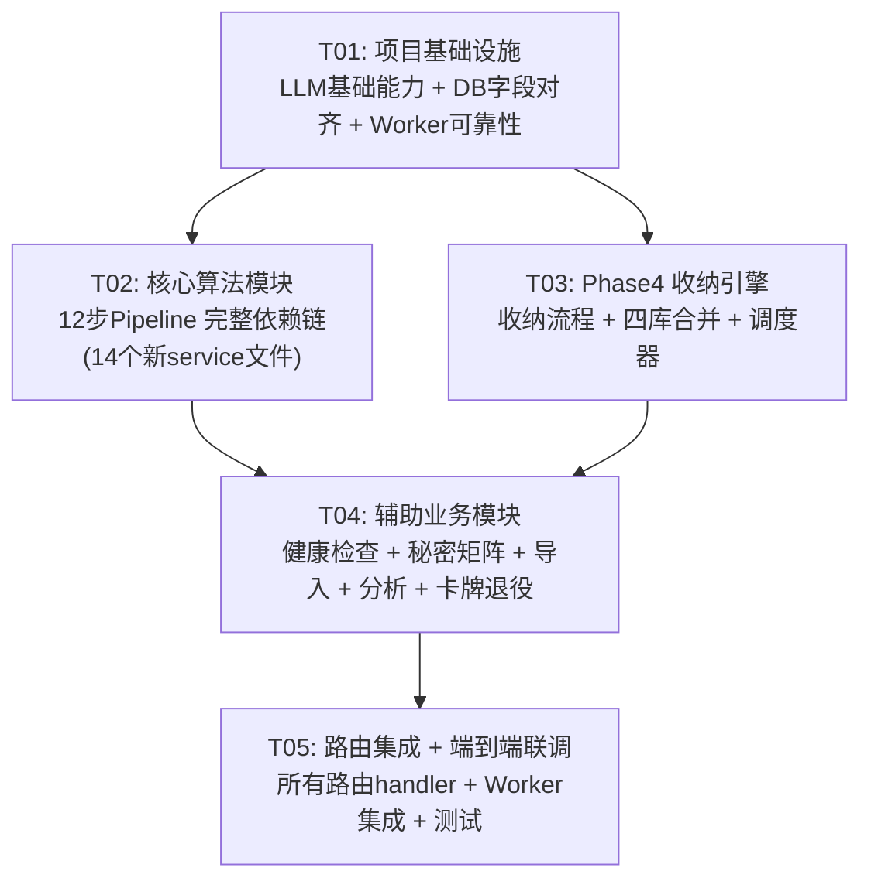

# 墨灵 Rust 重写 — 有序任务列表

> 作者：高见远（架构师）  
> 日期：2025-06-21  
> 总任务数：5（硬性上限）  
> 依赖模型：T01 → {T02, T03} → T04 → T05

---

## 依赖关系图



---

## T01：项目基础设施

| 属性 | 值 |
|------|---|
| **Task ID** | T01 |
| **优先级** | P0 |
| **预估复杂度** | 中等 |
| **依赖** | 无 |

### 实现内容

#### 1.1 LLM 基础能力补全（moling-llm）

从 Python `llm/key_manager.py`（KeyManager 双池管理）、`llm/context_budget.py`（分层截断）、`service/prompt_service.py`（4 层架构）移植核心逻辑到 Rust：

- **KeyRotator**（`key_rotator.rs`）：实现 Pro Pool + Flash Pool 双池，LEAST_USAGE 选择策略，Key 健康度检测 + 指数退避冷却（`[30, 60, 120, 300]s`），`NoAvailableKeyError` 异常
- **TokenBudget**（`budget.rs`）：实现分层截断策略（Layer 4→3→2 逐层压缩），`_CHARS_PER_TOKEN=4` 保守估算，`_SAFETY_FACTOR=0.85`，支持 `deepseek-chat/v3/r1` 等模型的上下文窗口映射
- **PromptBuilder**（`prompt.rs`）：完整 4 层架构 — Layer 0 系统指令 / Layer 1 动态层 / Layer 2 四库过滤数据 / Layer 3 卡牌融合方向 / Layer 4 风格约束
- **RateLimitTracker**（新增 `rate_limit.rs`）：从 Python `llm/client.py` 移植，追踪每个 API key 的 RPM/TPM，提供 `can_make_request()` 和 `get_wait_time()`

#### 1.2 数据库字段对齐（moling-db）

对照 Python `app/models/` 的 22 个 SQLAlchemy model，逐个验证 Rust `moling-db/src/entities/` 的 20 个 SeaORM entity：

- 检查字段类型：`JSON` ↔ `serde_json::Value`，`UUID` ↔ `String`，`DateTime` ↔ `chrono::DateTime<Utc>`
- 检查默认值：`server_default`、`nullable`、`default_value`
- 检查关系：`ForeignKey` 引用完整性
- 补充缺失的 entity：`ingest_job`（对应 Python `app/ingest/models.py` + `app/models/` 中缺失的）

#### 1.3 Worker 可靠性增强（moling-worker）

- **超时控制**：为所有 worker 添加 `tokio::time::timeout()`，generation worker 硬超时 10min、软超时 9min
- **自动重试**：在 `TaskQueue` 中添加 `retry_with_backoff()` 方法，指数退避 `[10, 30, 60, 120, 300]s`，最多 5 次
- **队列分离**：确保 `generation` 队列独立于 `default` 队列
- **Panic 恢复**：`std::panic::catch_unwind` 包裹每个 worker 入口
- **优雅关闭**：`tokio::signal::ctrl_c()` → drain queue → graceful shutdown

#### 1.4 补充 moling-db DAO 方法

对照 Python DAO 补充 Rust DAO 缺失的专用查询方法：
- `CardDao::list_active_by_project()` — 过滤 is_active + status
- `VaultDao::count_characters/timeline/plot_promises/worlds()` — 四库计数
- `DynamicLayerDao::get_by_project()` — 动态层查询
- `HealthAlertDao` 补充 `find_recent_by_project()` 等

### 涉及文件清单

```
moling-llm/src/key_rotator.rs        (重写: 双池管理 + 健康检测)
moling-llm/src/budget.rs             (重写: 分层截断策略)
moling-llm/src/prompt.rs             (重写: 4层Prompt组装)
moling-llm/src/rate_limit.rs         (新增: API Key限流)
moling-llm/src/lib.rs                (更新: 导出新模块)
moling-db/src/entities/ingest_job.rs (新增/验证: 导入任务实体)
moling-db/src/entities/mod.rs        (更新: 注册新实体)
moling-db/src/dao/card_dao.rs        (增强: 补充专用查询)
moling-db/src/dao/vault_dao.rs       (增强: 四库计数方法)
moling-db/src/dao/dynamic_layer_dao.rs (增强: 专用查询)
moling-db/src/dao/mod.rs             (更新: 注册新方法)
moling-db/src/migration/             (验证: 字段对齐 + 补充 migration)
moling-worker/src/queue.rs           (增强: 超时/重试/graceful shutdown)
moling-worker/src/workers/mod.rs     (增强: panic 恢复包装)
```

---

## T02：核心算法模块（12步 Pipeline 依赖链）

| 属性 | 值 |
|------|---|
| **Task ID** | T02 |
| **优先级** | P0 |
| **预估复杂度** | 复杂 |
| **依赖** | T01 |

### 实现内容

移植 Python 12 步 Generation Pipeline 的完整依赖链，共 14 个新 service 文件。

#### 2.1 底层算法服务（无 LLM 依赖的基础计算）

**VaultFilterService**（`vault_filter.rs`）← Python `vault_filter.py` (630 行)
- `filter_by_cards()`: 根据卡牌引用的 vault ID 精准提取角色/时间线/伏笔/世界观
- `filter_all()`: 无卡牌时的 Top-N fallback
- 层级压缩：≤30 章 Level 1（全文），>30 章 Level 2（仅 current_state）
- `_compress_characters()`: 角色条目截断到 300 字

**ValidationService**（`validation.rs`）← Python `validation_service.py` (879 行)
- 7 项预生成检查：角色一致性、时间线连续性、伏笔状态、秘密矩阵冲突、动态层约束、卡牌有效性、上下文预算
- 7 项后生成检查：角色行为一致性、伏笔推进、世界观规则、风格一致性、连贯性、重复检测、长度检查
- 返回 `CheckResult { passed, name, detail, suggestions, severity }`

**DynamicLayerService**（`dynamic_layer.rs`）← Python `dynamic_layer_dao.py` + `phase4_service.py` 中的动态层更新逻辑
- `get_dynamic_layer()`: 获取项目当前动态层状态
- `update_dynamic_layer()`: 根据篇章确认更新 must_hold/must_not/hooks/POV/location

#### 2.2 LLM 依赖的算法服务

**ConflictDetectionService**（`conflict_detection.rs`）← Python `conflict_detection.py` (808 行)
- 3 类冲突检测：Baseline 冲突（must_hold/must_not）、Secret Matrix 冲突（信息不对称）、State Machine 冲突（角色叙事状态）
- U 曲线置信度评分：`_compute_confidence(conflict_score) → [0, 1]`
- LLM fallback：低置信度（< 0.3）时调用 LLM 二次判断

**DirectionScoringService**（`direction_scoring.rs`）← Python `direction_scoring.py` (625 行)
- 方向相容性矩阵：4 种方向类型 × 4 种方向类型
- 实体冲突检测：同一实体被多张卡引用但描述矛盾
- 情感冲突检测：方向之间的情感基调冲突（平静/诙谐/戏剧/大胆）
- 置信度评分 + LLM fallback

**WeavingSchemeService**（`weaving_scheme.rs`）← Python `weaving_scheme.py` (803 行)
- 3 种编织模式：因果链 / 平行交替 / 主线+支线
- 规则引擎：根据卡片数量/权重/方向选择模式
- LLM fallback：置信度 ≤ 0.3 时调用 LLM
- 大纲模板：每种模式的 prompt_instruction + outline_template

**CoherenceService**（`coherence.rs`）← Python `coherence_service.py` (627 行)
- 3 组分组检查：A-叙事一致性（角色+时间线+伏笔）、B-写作质量（世界观+风格+节奏+基线）、C-连续性（章节过渡+秘密债务）
- DeepSeek transparent prefix caching：3 组共享 prompt 前缀
- 返回 `CoherenceValidationResult { passed, overall_score, version, groups }`

**SecretService 增强**（`secret_service.rs` 大幅扩充）← Python `secret_service.py` (725 行)
- `extract_secrets_from_content()`: LLM 从章节提取秘密信息
- `propagate_secrets()`: 跨角色传播秘密知识
- `expose_secrets()`: 条件满足时曝光秘密
- `calculate_debt()`: 秘密债务累积计算

#### 2.3 编排层

**AlgorithmService**（`algorithm.rs`）← Python `algorithm_service.py` (252 行)
- `step1_weight_allocation()`: 稀有度基础权重 × 用户调整
- `step2_vault_filter()`: 委托 VaultFilterService
- `step3_conflict_detection()`: 委托 ConflictDetectionService
- `step4_direction_scoring()`: 委托 DirectionScoringService
- `step5_weaving_scheme()`: 委托 WeavingSchemeService
- `step6_outline_fill()`: 大纲模板变量填充

**GenerationService 重写**（`generation_service.rs` 大量扩充）← Python `generation_service.py` (938 行)
- `execute_generation_pipeline()`: 12 步完整流程
  1. 权重分配 → 2. 四库过滤 → 3. 冲突检测 → 4. 方向评分 → 5. 编织匹配 → 6. 大纲填充 → 7. Prompt 组装 → 8. LLM 调用 → 9. 秘密提取 → 10. 连贯性验证 → 11. 自动合并（HIGH/MEDIUM 置信度）→ 12. 动态层更新 + 卡牌池刷新
- 进度追踪: `progress_percent` 和 `progress_stage` 在每个步骤更新
- Celery/Queue 分发: 通过 `TaskQueue::push("generation", task)` 异步执行

**CardService 重写**（`card_service.rs` 大幅扩充）← Python `card_service.py` (442 行) + `card_pool_service.py` (216 行)
- `_calculate_card_weight()`: 稀有度基础 × 保底加成 × 新鲜度加成
- `draw_cards()`: 加权随机抽卡 + 保底机制 + 重试上限
- `_calc_freshness_score()`: 抽牌惩罚 + 年龄惩罚 + 未抽牌加成
- `check_freshness()`: 批量新鲜度评估

### 涉及文件清单

```
# 新增文件 (14个)
moling-services/src/vault_filter.rs        (新增: 四库过滤 + 层级压缩)
moling-services/src/validation.rs          (新增: 14项生成检查)
moling-services/src/dynamic_layer.rs       (新增: 动态层管理)
moling-services/src/conflict_detection.rs  (新增: 3类冲突检测 + U曲线)
moling-services/src/direction_scoring.rs   (新增: 方向相容性矩阵)
moling-services/src/weaving_scheme.rs      (新增: 3种编织模式 + 规则引擎)
moling-services/src/coherence.rs           (新增: 3组分组成对一致性)
moling-services/src/algorithm.rs           (新增: 6步算法编排)
moling-services/src/card_pool.rs           (新增: 新鲜度计算)
moling-services/src/merge.rs               (新增: 四库合并引擎)

# 重写/大幅扩充文件 (4个)
moling-services/src/secret_service.rs      (重写: LLM提取 + 传播 + 债务)
moling-services/src/generation_service.rs  (重写: 12步完整pipeline)
moling-services/src/card_service.rs        (重写: 加权抽卡算法)
moling-services/src/prompt_service.rs      (扩充: 完整4层架构)

# 注册文件
moling-services/src/lib.rs                 (更新: 导出所有新模块)
```

---

## T03：Phase4 收纳引擎

| 属性 | 值 |
|------|---|
| **Task ID** | T03 |
| **优先级** | P0 |
| **预估复杂度** | 复杂 |
| **依赖** | T01 |

### 实现内容

从 Python 移植 Phase4 收纳系统，包括收纳服务、调度器和存储后端。

#### 3.1 Phase4Service 完整实现

（`phase4_service.rs` 重写）← Python `phase4_service.py` (2,396 行)

- `confirm_storage()`: 确认收纳请求，创建 Phase4Task
- `run_phase4()`: 执行完整收纳流程
  1. LLM 调用：`_call_llm_for_extraction()` — 使用 EXTRACTION_SCHEMA 提取四库变更
  2. JSON 解析：`_parse_extraction_result()` — 解析 LLM 返回的 JSON，验证 schema
  3. SourceText Grounding：`_verify_source_text()` — 编辑距离验证，阈值=85%
  4. 实体名规范化：`_normalize_entity_names()` — 模糊匹配合并，编辑距离阈值=3
  5. 合并执行：`_apply_merges()` — 委托 MergeService 逐库合并
  6. 动态层更新：`_update_dynamic_layer()` — 更新 must_hold/must_not/hooks
  7. 卡牌池刷新：`_refresh_card_pool()` — 从四库变更生成新卡牌
  8. 退役检查：`_check_card_retire()` — 委托 CardRetireService

同时实现：
- **CardRetireService**（`card_retire.rs`）← Python `card_retire_service.py` (186 行)
  - `check_and_retire()`: 上限检查（MAX_ACTIVE_CARDS=80）+ 新鲜期过期（FRESHNESS_LIFESPAN=4 章）
  - 淘汰策略：最旧的卡牌优先退役

#### 3.2 Phase4Scheduler

（`phase4_scheduler.rs` 新增）← Python `phase4_scheduler.py` (1,338 行)

- `enqueue()`: 将收纳任务加入队列
- `process_loop()`: 主循环 —— 从队列取任务 → 获取分布式锁 → 执行收纳 → 释放锁
- `VaultVersion`: 四库版本管理（current / pending / last_stable）
- `SchedulerState`: 调度器全局状态（queue / executed_nonces / fallback_queue / consecutive_failures）
- 分布式锁：`acquire_lock()` / `release_lock()`，基于 Redis SETNX，TTL=30s
- 幂等性：nonce 去重，LRU 缓存上限 1000
- 竞态防护：写入锁 + 版本号乐观锁
- 指数退避重试：`[10, 30, 60, 120, 300]s`，最多 5 次
- 内容安全验证：SourceText Grounding（相似度阈值 85%）

#### 3.3 Phase4Store

（`phase4_store.rs` 新增）← Python `phase4_store.py` (201 行)

- 双模后端：Redis 优先（耐久 + 跨 Worker 协调），内存回退（单 Worker 开发）
- 接口：`sismember/sadd`（nonce）、`setnx_ex/get_lock_owner/release_lock`（分布式锁）、`hset_task/hget_task`（任务状态）
- `_MemoryStore`: asyncio.Lock 保护的内存实现
- `_RedisStore`: Redis 命令封装

### 涉及文件清单

```
# 新增文件 (2个)
moling-services/src/phase4_scheduler.rs  (新增: 调度器 + 竞态防护 + 重试)
moling-services/src/phase4_store.rs      (新增: 双模 Redis/内存后端)

# 重写/大幅扩充文件 (3个)
moling-services/src/phase4_service.rs    (重写: 8步完整收纳流程)
moling-services/src/card_retire.rs       (新增: 卡牌退役服务)
moling-services/src/merge.rs             (扩充: 如T02已创建则扩充四库合并)

# 更新文件
moling-services/src/lib.rs               (更新: 导出新模块)
```

---

## T04：辅助业务模块

| 属性 | 值 |
|------|---|
| **Task ID** | T04 |
| **优先级** | P1 |
| **预估复杂度** | 中等 |
| **依赖** | T02, T03 |

### 实现内容

移植剩余的辅助服务模块。

#### 4.1 HealthService 完整实现

（`health_service.rs` 重写）← Python `health_service.py` (363 行) + `health_monitor.py` (460 行)

- `run_health_check()`: R1 角色一致性 + R2 时间线连续性 + R3 伏笔债务
- `_check_r1_character_consistency()`: 角色重复/冲突/遗漏检测
- `_check_r2_timeline_continuity()`: 时间线事件顺序/间隙/矛盾
- `_check_r3_plot_promise_debt()`: 未兑现承诺检测 + 超时告警
- 防疲劳过滤：同一告警 3 章内不重复

**HealthMonitorService**（`health_monitor.rs` 新增）← Python `health_monitor.py`
- `check_health()`: 对 VaultPlotPromise 执行 R1/R2/R3 规则
- R1: 8 章未推进 → yellow 告警
- R2: 4 次同类推进 → 模式异常告警
- R3: 10 章静默 → 降级告警
- 防疲劳窗口：3 章内不重复

#### 4.2 ImportService 完整实现

（`import_service.rs` 重写）← Python `import_service.py` (618 行) + `ingest/phase1/2/3/`

- `file_import()`: 文件上传 → 创建 IngestJob
- `phase1_extract()`: 章节拆分（`_CHAPTER_PATTERNS` 正则匹配）+ 元数据提取 + 内容清洗
- `phase2_analyze()`: 章节结构分析 + 风格检测
- `phase3_commit()`: 创建 Project + 批量写入 Chapter + 冲突处理
- `full_import()`: phase1 → phase2 → phase3 流水线

章节拆分正则从 Python 移植（第X章/Chapter X/数字序号/卷部篇）。

#### 4.3 BookAnalysisService

（`book_analysis.rs` 新增）← Python `book_analysis_service.py` (689 行)

- `analyze_characters()`: 中文名/英文名正则提取 + 共现关系 + 档案生成
- `analyze_plot()`: 情节结构识别 + 漏洞检测
- `detect_style()`: 对话比例/句长/段落节奏/词汇丰富度
- `_STOP_NAMES`: 停用词集合（中文虚词 + 英文代词）

#### 4.4 WeaveService 完整实现

（`weave_service.rs` 重写）← Python `weave_service.py` (326 行)

- `get_suggestions()`: LLM 深度编织分析（情节线索/人物弧光/时间线）
- `apply_suggestions()`: 应用到指定章节
- `analyze()`: 叙事结构一致性分析

#### 4.5 路由中涉及的辅助模块

**Genre 模块**（`genre.rs` 新增）← Python `app/genre/` 目录 (7 文件)
- A1 Opening 分析 / A2 Characters 分析 / A3 Hooks 分析 / A4 Rhythm 分析 / A5 Profile Output
- ColdStartLoader: 冷启动加载器

### 涉及文件清单

```
# 新增文件 (3个)
moling-services/src/health_monitor.rs    (新增: 子情节健康监控)
moling-services/src/book_analysis.rs     (新增: 书籍分析服务)
moling-services/src/genre.rs             (新增: Genre分析模块)

# 重写/大幅扩充文件 (3个)
moling-services/src/health_service.rs    (重写: R1/R2/R3健康检查)
moling-services/src/import_service.rs    (重写: 3阶段导入pipeline)
moling-services/src/weave_service.rs     (重写: LLM编织分析)

# 更新文件
moling-services/src/lib.rs               (更新: 导出新模块)
```

---

## T05：路由集成 + Worker 集成 + 端到端联调

| 属性 | 值 |
|------|---|
| **Task ID** | T05 |
| **优先级** | P1 |
| **预估复杂度** | 中等 |
| **依赖** | T04 |

### 实现内容

#### 5.1 路由 Handler 补全（moling-api）

将所有路由的 handler 连接到已实现的 service 方法：

- **routes/card.rs** → `CardService::draw_cards()`, `CardService::list_cards()` 等
- **routes/generation.rs** → `GenerationService::start_generation()`, `GenerationService::execute_pipeline()` 等
- **routes/phase4.rs** → `Phase4Service::confirm_storage()`, `Phase4Service::run_phase4()` 等
- **routes/secret.rs** → `SecretService::extract_secrets_from_content()`, `SecretService::list()` 等
- **routes/health.rs** → `HealthService::run_health_check()`, `HealthMonitorService::check_health()` 等
- **routes/import_route.rs** → `ImportService::file_import()`, `ImportService::full_import()` 等
- **routes/weave.rs** → `WeaveService::get_suggestions()`, `WeaveService::analyze()` 等
- **routes/genre.rs** → Genre 分析各端点
- **routes/admin.rs** → 管理端点（系统配置、统计等）

所有 handler 统一返回格式：`{ "code": "...", "message": "...", "data": ... }`

#### 5.2 Worker 集成（moling-worker）

- **generation worker**: 连接 `GenerationService::execute_pipeline()` 到队列消费
- **phase4 worker**: 连接 `Phase4Scheduler::process_loop()` 到队列消费
- **vault_reanalyze worker**: 连接 `VaultService::reanalyze()` 到 cron 调度
- **card_retire worker**: 连接 `CardRetireService::check_and_retire()` 到 cron 调度
- **health_notify worker**: 连接 `HealthMonitorService::check_health()` 到 cron 调度（每 10 分钟）
- **import_task worker**: 连接 `ImportService::full_import()` 到队列消费
- **analysis worker**: 连接 `BookAnalysisService` 方法到队列消费

#### 5.3 端到端联调

- 验证：`cargo check` 全 workspace 通过（0 errors, 0 warnings）
- 验证：`cargo test` 全部通过
- 验证：`moling-server` 启动 → 路由可达 → 数据库连接正常 → Redis 连接正常
- 验证：Worker 启动 → 队列消费正常 → cron 调度正常
- 验证：关键流程端到端
  - 注册 → 登录 → 创建项目 → 创建章节 → 抽卡 → 生成 → 确认收纳 → 查看四库
  - 导入书籍 → 分析 → 查看结果
  - 健康检查 → 告警生成

#### 5.4 文档回填

更新 `docs/ARCHITECTURE.md`、`docs/SPECIFICATIONS.md`、`docs/DESIGN.md` 三份核心文档：
- 补全 8 crate 架构说明
- 记录每个模块的完成状态
- 更新 API 端点列表
- 记录已实现的 ADR（架构决策记录）

### 涉及文件清单

```
# 路由补全 (11个)
moling-api/src/routes/card.rs            (补全: 连接CardService)
moling-api/src/routes/generation.rs      (补全: 连接GenerationService)
moling-api/src/routes/phase4.rs          (补全: 连接Phase4Service)
moling-api/src/routes/secret.rs          (补全: 连接SecretService)
moling-api/src/routes/health.rs          (补全: 连接HealthService)
moling-api/src/routes/import_route.rs    (补全: 连接ImportService)
moling-api/src/routes/weave.rs           (补全: 连接WeaveService)
moling-api/src/routes/genre.rs           (补全: 连接Genre模块)
moling-api/src/routes/admin.rs           (补全: 管理端点)

# Worker集成 (7个)
moling-worker/src/workers/generation.rs  (重写: 完整LLM调用)
moling-worker/src/workers/phase4.rs      (重写: Phase4 pipeline)
moling-worker/src/workers/vault_reanalyze.rs (重写: Vault重分析)
moling-worker/src/workers/card_retire.rs (重写: 卡牌退役)
moling-worker/src/workers/health_notify.rs  (重写: 健康通知)
moling-worker/src/workers/import_task.rs (重写: 导入任务)
moling-worker/src/workers/analysis.rs    (重写: 书籍分析)

# 入口 + 文档
moling-server/src/main.rs                (更新: 完整启动流程)
docs/ARCHITECTURE.md                     (更新: 8 crate架构)
docs/SPECIFICATIONS.md                   (更新: 模块状态)
docs/DESIGN.md                           (更新: ADR记录)
```

---

## 共享知识（Shared Knowledge）

### 代码规范
- 所有 API 响应使用 `{ "code": "...", "message": "...", "data": ... }` 格式
- 认证使用 JWT Bearer token（access token 15min / refresh token 30day）
- 所有日期时间存储为 UTC ISO 8601
- 软删除标记使用 `is_deleted` + `deleted_at` 字段

### 错误处理
- 所有 fallible 函数返回 `AppResult<T>`（即 `Result<T, AppError>`）
- 使用 `?` 操作符传播错误
- HTTP 状态码映射：`AppError::status()` → 400/401/403/404/409/429/500

### 事务管理
- 读操作无事务
- 单表写操作：SeaORM `ActiveModel::update/insert`
- 多表写操作（Phase4 收纳）：`db.begin().await` → 操作 → `tx.commit().await`
- Worker 任务：每个任务独立事务

### 日志规范
- 使用 `tracing` crate
- 级别：`ERROR`（不可恢复）、`WARN`（可重试）、`INFO`（关键操作）、`DEBUG`（详细流程）
- 关键操作日志：task_id、project_id、user_id、chapter_id

### LLM 调用约定
- 统一通过 `moling-llm::DeepSeekClient` 调用
- API Key 通过 `KeyRotator::next("pro"|"flash")` 获取
- 每次调用前检查 `TokenBudget::check(prompt, model)` → `BudgetResult`
- 失败自动重试 3 次（`tenacity` 等效的指数退避）

### 并发安全
- Service 层：所有 service 为 `Clone` + `Send + Sync`，通过 `Arc` 共享
- Worker 层：每个 worker 独立 tokio task，通过 `mpsc` channel 通信
- Phase4 调度器：Redis 分布式锁（SET NX EX），TTL=30s
- 幂等性：Redis SET NX + DB 状态检查
