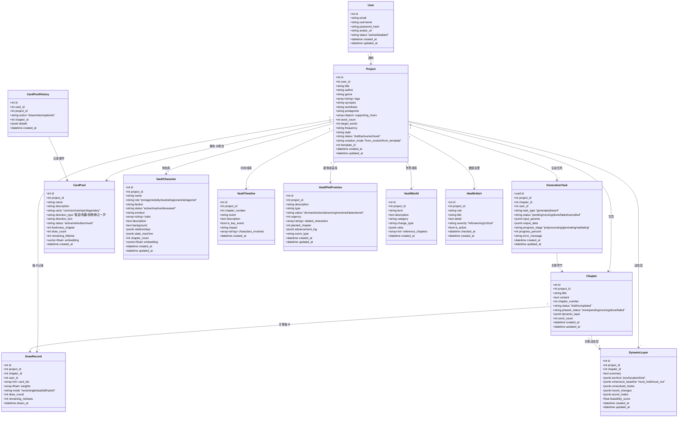
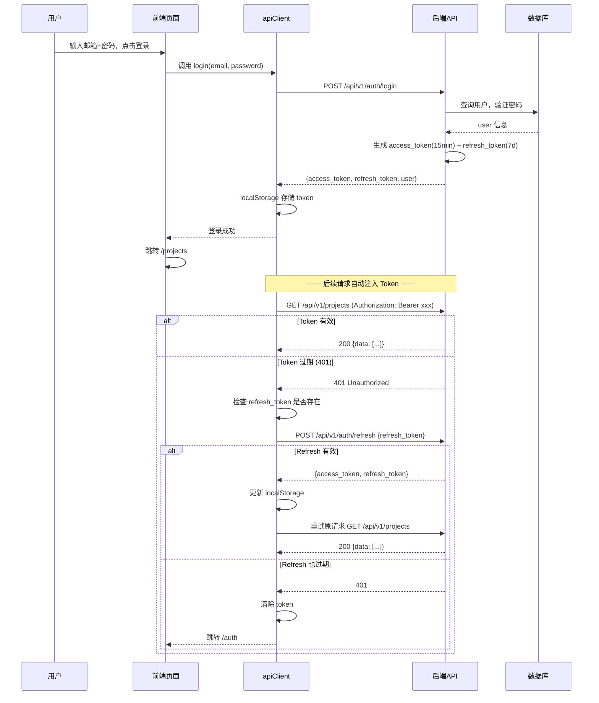
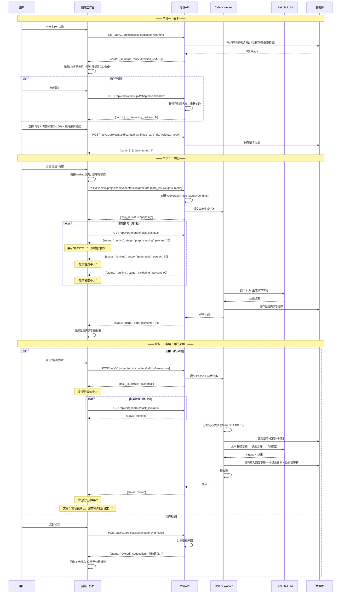
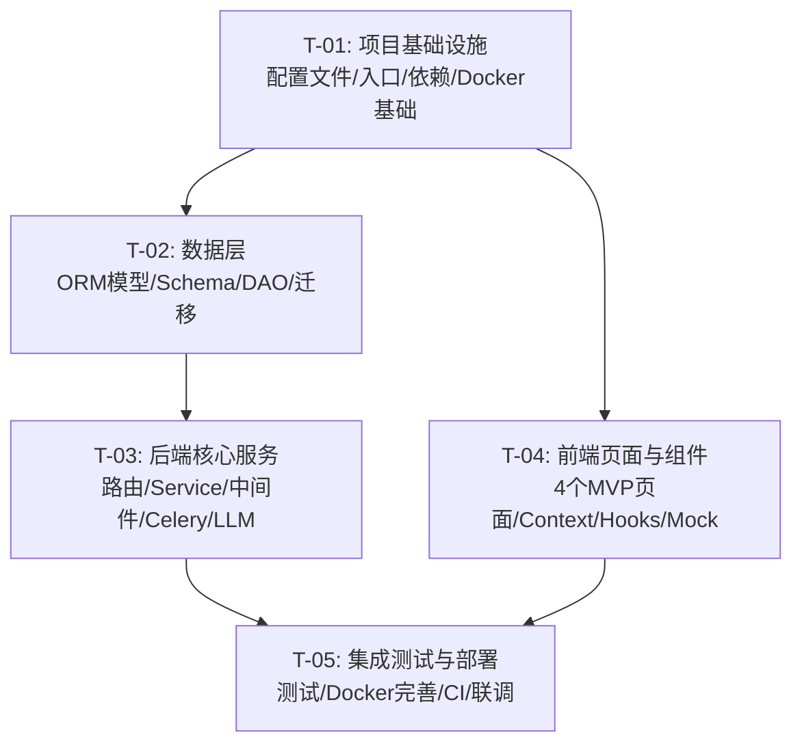

# 墨灵 MVP · 系统架构设计与任务分解

> **文档版本**：v1.0  
> **架构师**：Bob（高见远）  
> **创建日期**：2026-06-12  
> **数据来源**：PRD_墨灵MVP.md、墨灵后端设计文档 v1.0、前后端接口映射文档、UI 机密文档、4 个 MVP 页面 HTML 原型、卡牌组合算法 v2.0

---

## Part A：系统架构设计

---

### 1. 实施方法（Implementation Approach）

#### 1.1 核心技术难点分析

| 难点 | 描述 | 解决方案 |
|:----|:-----|:---------|
| **LLM 异步生成** | 章节生成需 5-30 秒，不能阻塞 HTTP 请求 | Celery 异步任务 + 前端轮询 status |
| **Phase 4 收纳** | 确认收纳后需多步 LLM 调用更新四库，需事务保障 | Celery chain + 分布式锁 + PostgreSQL 事务 |
| **抽卡概率系统** | 卡牌稀有度权重、新鲜期加成、冷却机制 | Redis 计数器 + 权重算法（服务层封装） |
| **UI 安全约束** | 生成步骤模糊化、动态层移除、工程术语替代表 | 前端文案常量表 + 后端返回抽象状态 |
| **四库异构数据** | 四个库结构不同但共享查询模式 | SQLAlchemy 联合表继承 + JSONB 灵活字段 |
| **Token 自动刷新** | 401 后静默 refresh 并重试原请求 | 封装统一 apiClient 拦截器 |

#### 1.2 架构模式

| 层 | 模式 |
|:--|:-----|
| **后端整体** | Route → Service → DAO 三层架构，依赖注入 |
| **数据库访问** | Repository 模式 + Unit of Work |
| **异步任务** | Celery Task → Service 委托模式 |
| **前端状态** | React Context + useReducer（MVVM 风格） |
| **API 设计** | RESTful，统一 `{code, message, data, request_id}` |

---

### 2. 项目目录结构

#### 2.1 前端（Next.js 19 + App Router + TypeScript + CSS Modules）

```
moling-web/
├── package.json                          # 依赖声明
├── tsconfig.json                         # TypeScript 配置
├── next.config.ts                        # Next.js 配置
├── .env.local                            # 环境变量
├── public/                               # 静态资源
│   ├── favicon.ico
│   └── images/
│       ├── logo.svg
│       └── card-*.svg                    # 卡牌稀有度图标
│
├── src/
│   ├── app/                              # App Router 页面
│   │   ├── layout.tsx                    # 根布局（全局 Provider 包装）
│   │   ├── page.tsx                      # 根路由重定向 → /projects
│   │   ├── globals.css                   # 全局样式（设计令牌）
│   │   │
│   │   ├── (auth)/                       # Auth 路由组（无导航栏）
│   │   │   ├── layout.tsx                # Auth 布局（居中卡片样式）
│   │   │   └── auth/
│   │   │       ├── page.tsx              # 登录/注册/重置页（Client Component）
│   │   │       └── auth.module.css       # Auth 页面样式
│   │   │
│   │   ├── projects/                     # 项目相关（需认证）
│   │   │   ├── layout.tsx                # 项目布局（顶部导航栏）
│   │   │   ├── page.tsx                  # 项目列表页（Server Component）
│   │   │   ├── projects.module.css
│   │   │   └── new/
│   │   │       ├── page.tsx              # 新建项目页（Client Component）
│   │   │       └── new-project.module.css
│   │   │
│   │   └── workspace/
│   │       └── [projectId]/
│   │           ├── page.tsx              # 工作台页面（Client Component）
│   │           ├── workspace.module.css  # 工作台样式
│   │           └── loading.tsx           # 工作台加载骨架屏
│   │
│   ├── components/                       # 共享组件
│   │   ├── ui/                           # 通用 UI 组件
│   │   │   ├── Button.tsx
│   │   │   ├── Modal.tsx
│   │   │   ├── Toast.tsx
│   │   │   ├── Skeleton.tsx
│   │   │   ├── Input.tsx
│   │   │   ├── Spinner.tsx
│   │   │   └── EmptyState.tsx
│   │   ├── layout/                       # 布局组件
│   │   │   ├── Navbar.tsx                # 顶部导航栏
│   │   │   └── Navbar.module.css
│   │   ├── auth/                         # Auth 组件
│   │   │   ├── LoginForm.tsx
│   │   │   ├── RegisterForm.tsx
│   │   │   ├── ResetPasswordForm.tsx
│   │   │   └── AuthTabs.tsx
│   │   ├── project/                      # 项目相关组件
│   │   │   ├── ProjectCard.tsx
│   │   │   ├── ProjectStats.tsx
│   │   │   ├── ProjectDetailModal.tsx
│   │   │   ├── ProjectForm.tsx
│   │   │   ├── TemplateSelector.tsx
│   │   │   └── CreationModeCard.tsx
│   │   ├── workspace/                    # 工作台组件
│   │   │   ├── Editor.tsx                # 章节编辑器
│   │   │   ├── LeftPanel.tsx             # 左侧四库侧栏
│   │   │   ├── RightPanel.tsx            # 右侧 AI 建议面板
│   │   │   ├── VaultTabs.tsx             # 四库 Tab 切换
│   │   │   ├── CharacterList.tsx
│   │   │   ├── TimelineList.tsx
│   │   │   ├── PlotPromiseList.tsx
│   │   │   ├── WorldList.tsx
│   │   │   ├── CardModal.tsx             # 抽卡模态框
│   │   │   ├── InspirationCard.tsx       # 单张灵感卡
│   │   │   ├── WeightSlider.tsx          # 权重滑块
│   │   │   ├── GenerationProgress.tsx    # 进度动画（3阶段）
│   │   │   ├── HealthAlert.tsx           # 健康告警横幅
│   │   │   ├── ToolBar.tsx               # 底部工具栏
│   │   │   └── ChapterSelector.tsx       # 章节选择器
│   │   └── cards/                        # 卡牌通用组件
│   │       └── CardRarityBadge.tsx
│   │
│   ├── contexts/                         # React Context 状态管理
│   │   ├── AuthContext.tsx               # 认证状态（user/token/login/logout）
│   │   ├── ProjectContext.tsx            # 当前项目状态
│   │   └── WorkspaceContext.tsx          # 工作台状态（章节/卡牌/生成/收纳）
│   │
│   ├── hooks/                            # 自定义 Hooks
│   │   ├── useAuth.ts                    # 认证相关 hook
│   │   ├── useApi.ts                     # API 请求 hook（含自动 refresh）
│   │   ├── useProjects.ts               # 项目列表 hook
│   │   ├── useWorkspace.ts              # 工作台状态 hook
│   │   ├── usePolling.ts                # 轮询 hook（用于生成进度）
│   │   └── useDebounce.ts               # 防抖 hook
│   │
│   ├── lib/                              # 工具库
│   │   ├── apiClient.ts                  # 统一 API 客户端（含 Token 刷新拦截）
│   │   ├── api.ts                        # API 函数集合（按模块分组）
│   │   ├── auth.ts                       # Token 存储/读取/清除
│   │   ├── constants.ts                  # 常量（安全文案、路由等）
│   │   └── types.ts                      # 全局 TypeScript 类型定义
│   │
│   └── mock/                             # Mock 数据（API 未就绪时占位）
│       ├── projects.ts
│       ├── chapters.ts
│       ├── cards.ts
│       ├── vault.ts
│       └── health.ts
│
├── docker/
│   ├── Dockerfile                        # 前端 Dockerfile
│   └── nginx.conf                        # Nginx 配置（生产）
│
└── docs/                                 # 文档
    └── api-integration.md                # API 对接指南
```

#### 2.2 后端（FastAPI + Python 3.12+）

```
moling-server/
├── pyproject.toml                        # 项目元数据 + 依赖声明
├── requirements.lock                     # 依赖锁定
├── alembic.ini                           # Alembic 配置
├── Makefile                              # 常用命令快捷入口
├── .env.example                          # 环境变量模板
│
├── alembic/
│   ├── env.py                            # Alembic 运行时配置
│   ├── script.py.mako                    # 迁移脚本模板
│   └── versions/
│       ├── 0001_initial_schema.py        # 初始 Schema
│       └── 0002_add_card_pool.py         # 卡牌池模型
│
├── app/
│   ├── __init__.py                       # 版本常量
│   ├── main.py                           # FastAPI 应用入口
│   ├── config.py                         # 配置管理（Pydantic Settings）
│   ├── dependencies.py                   # 全局依赖注入
│   ├── errors.py                         # 业务异常定义
│   │
│   ├── api/
│   │   ├── __init__.py
│   │   └── v1/
│   │       ├── __init__.py               # 统一导出 v1 路由
│   │       ├── auth.py                   # 认证路由（P0: 6 端点）
│   │       ├── projects.py               # 项目路由（P0: 3 + P1: 3）
│   │       ├── chapters.py               # 章节路由（P0: 5）
│   │       ├── cards.py                  # 卡牌路由（P0: 3）
│   │       ├── generation.py             # 生成/收纳路由（P0: 4 + P1: 2）
│   │       ├── vault.py                  # 四库路由（P0: 4）
│   │       ├── health.py                 # 健康告警路由（P0: 1 + P1: 1）
│   │       ├── settings.py               # 设置路由（P1 预留）
│   │       └── templates.py             # 模板路由（P1: 1）
│   │
│   ├── models/
│   │   ├── __init__.py                   # 导出所有模型
│   │   ├── base.py                       # 声明式基类
│   │   ├── mixins.py                     # 可复用混入
│   │   ├── user.py                       # User 模型
│   │   ├── project.py                    # Project 模型
│   │   ├── chapter.py                    # Chapter 模型
│   │   ├── vault_character.py            # 角色库模型
│   │   ├── vault_timeline.py             # 时间线库模型
│   │   ├── vault_plot_promise.py         # 剧情承诺库模型
│   │   ├── vault_world.py                # 世界观库模型
│   │   ├── card_pool.py                  # 卡牌池模型
│   │   ├── draw_history.py               # 抽卡历史模型
│   │   ├── draw_record.py                # 抽卡记录（每次抽卡）
│   │   ├── generation_task.py            # 生成任务模型
│   │   └── dynamic_layer.py              # 动态层模型
│   │
│   ├── schemas/
│   │   ├── __init__.py                   # 导出所有 Schema
│   │   ├── common.py                     # 公共 Schema
│   │   ├── auth.py                       # 认证 Schema
│   │   ├── project.py                    # 项目 Schema
│   │   ├── chapter.py                    # 章节 Schema
│   │   ├── card.py                       # 卡牌 Schema
│   │   ├── vault.py                      # 四库 Schema
│   │   ├── generation.py                 # 生成 Schema
│   │   ├── health.py                     # 健康告警 Schema
│   │   └── template.py                   # 模板 Schema
│   │
│   ├── services/
│   │   ├── __init__.py
│   │   ├── base_service.py               # Service 基类
│   │   ├── auth_service.py               # 认证服务
│   │   ├── project_service.py            # 项目服务
│   │   ├── chapter_service.py            # 章节服务
│   │   ├── vault_service.py              # 四库服务
│   │   ├── card_service.py               # 卡牌服务
│   │   ├── generation_service.py         # 生成服务
│   │   ├── phase4_service.py             # Phase 4 调度服务
│   │   └── health_service.py             # 健康告警服务
│   │
│   ├── dao/
│   │   ├── __init__.py
│   │   ├── base_dao.py                   # 泛型 DAO 基类
│   │   ├── user_dao.py
│   │   ├── project_dao.py
│   │   ├── chapter_dao.py
│   │   ├── vault_dao.py                  # 四库 DAO（联合处理四个表）
│   │   ├── card_dao.py
│   │   └── generation_dao.py             # 生成任务 DAO
│   │
│   ├── tasks/
│   │   ├── __init__.py
│   │   ├── celery_app.py                 # Celery 应用配置
│   │   ├── base_task.py                  # Task 基类
│   │   ├── phase4_task.py                # Phase 4 收纳任务
│   │   └── generation_task.py            # 生文任务
│   │
│   ├── llm/
│   │   ├── __init__.py
│   │   ├── gateway.py                    # LLM 统一网关
│   │   ├── router.py                     # 模型路由策略
│   │   ├── context.py                    # 上下文管理
│   │   ├── schemas.py                    # LLM 输入/输出类型
│   │   └── prompts/
│   │       ├── __init__.py
│   │       ├── generation/
│   │       │   ├── continue.j2
│   │       │   └── brainstorm.j2
│   │       └── extraction/
│   │           ├── character.j2
│   │           ├── timeline.j2
│   │           ├── plot.j2
│   │           └── world.j2
│   │
│   ├── middleware/
│   │   ├── __init__.py
│   │   ├── request_id.py                 # 请求 ID 中间件
│   │   ├── auth.py                       # JWT 认证中间件
│   │   ├── rate_limit.py                 # 速率限制中间件
│   │   ├── logging_mw.py                 # 结构化日志中间件
│   │   └── response_format.py            # 统一响应格式化
│   │
│   └── utils/
│       ├── __init__.py
│       ├── security.py                   # 密码哈希 / JWT 工具
│       ├── time.py                       # 时间工具
│       ├── text.py                       # 文本处理
│       └── cache.py                      # Redis 缓存工具
│
├── tests/
│   ├── __init__.py
│   ├── conftest.py                       # pytest 全局 Fixture
│   ├── test_api/
│   │   ├── test_auth.py
│   │   ├── test_projects.py
│   │   ├── test_chapters.py
│   │   ├── test_cards.py
│   │   └── test_vault.py
│   ├── test_services/
│   │   ├── test_auth_service.py
│   │   ├── test_card_service.py
│   │   └── test_phase4_service.py
│   └── test_tasks/
│       └── test_phase4_task.py
│
├── docker/
│   ├── Dockerfile                        # 后端 Dockerfile
│   ├── Dockerfile.celery                 # Celery Worker 镜像
│   └── docker-compose.yml               # 本地开发编排
│
└── scripts/
    ├── init_db.sh                        # 初始化数据库
    └── seed_data.py                      # 开发种子数据
```

---

### 3. 数据模型（Mermaid Class Diagram）



---

### 4. API 接口设计

#### 4.1 API 总览（MVP 范围：P0 24 端点 + P1 10 端点）

所有 API 前缀为 `/api/v1`，统一响应格式 `{code, message, data, request_id}`。

```mermaid
classDiagram
    class AuthRoutes {
        +POST /auth/register          P0 注册
        +POST /auth/login             P0 登录
        +POST /auth/refresh           P0 刷新Token
        +GET  /auth/me                P0 当前用户
        +POST /auth/password-reset-request  P0 请求重置
        +POST /auth/password-reset    P0 设置新密码
    }

    class ProjectRoutes {
        +GET    /projects             P0 项目列表
        +GET    /projects/stats       P0 项目统计
        +POST   /projects             P0 创建项目
        +GET    /projects/:id         P1 项目详情
        +PUT    /projects/:id         P1 编辑项目
        +DELETE /projects/:id         P1 删除项目
        +GET    /projects/suggestions P1 创作建议
    }

    class ChapterRoutes {
        +GET   /projects/:pid/chapters/current  P0 当前章节
        +GET   /projects/:pid/chapters          P0 章节列表
        +POST  /projects/:pid/chapters          P0 创建章节
        +GET   /projects/:pid/chapters/:id      P0 章节详情
        +PUT   /projects/:pid/chapters/:id      P0 更新章节
    }

    class CardRoutes {
        +GET  /projects/:pid/cards/pool              P0 候选卡池
        +POST /projects/:pid/cards/draw               P0 执行抽卡
        +POST /projects/:pid/chapters/:id/redraw      P0 重抽
    }

    class GenerationRoutes {
        +POST /projects/:pid/chapters/:id/generate    P0 触发生成
        +GET  /generate/:task_id/status               P0 生成状态轮询
        +POST /generate/:task_id/cancel               P1 取消生成
    }

    class Phase4Routes {
        +POST /projects/:pid/chapters/:id/confirm     P0 确认收纳
        +POST /projects/:pid/chapters/:id/revise      P0 拒稿修改
    }

    class VaultRoutes {
        +GET /projects/:pid/vault/characters     P0 角色列表
        +GET /projects/:pid/vault/timeline       P0 时间线
        +GET /projects/:pid/vault/plot-promises  P0 剧情承诺
        +GET /projects/:pid/vault/world          P0 世界观
    }

    class HealthRoutes {
        +GET  /projects/:pid/health              P0 健康告警
        +POST /projects/:pid/health/refresh      P1 刷新检查
    }

    class AIRoutes {
        +POST /projects/:pid/chapters/:id/agent  P1 AI指令
    }

    class TemplateRoutes {
        +GET /templates                          P1 模板列表
    }

    class Services {
        AuthService
        ProjectService
        ChapterService
        CardService
        GenerationService
        Phase4Service
        VaultService
        HealthService
    }

    class DAOs {
        UserDAO
        ProjectDAO
        ChapterDAO
        CardDAO
        VaultDAO
        GenerationDAO
    }

    AuthRoutes --> AuthService
    ProjectRoutes --> ProjectService
    ChapterRoutes --> ChapterService
    CardRoutes --> CardService
    GenerationRoutes --> GenerationService
    Phase4Routes --> Phase4Service
    VaultRoutes --> VaultService
    HealthRoutes --> HealthService

    AuthService --> UserDAO
    ProjectService --> ProjectDAO
    ChapterService --> ChapterDAO
    CardService --> CardDAO
    GenerationService --> ChapterDAO
    GenerationService --> GenerationDAO
    Phase4Service --> ChapterDAO
    Phase4Service --> VaultDAO
    Phase4Service --> CardDAO
    VaultService --> VaultDAO
```



---

### 5. 核心流程时序图

#### 5.1 登录认证流程（含 Token 刷新）



#### 5.2 抽卡 → 生成 → 收纳三段流水线



---

### 6. 待明确事项

| # | 问题 | 建议方案 | 影响范围 |
|:--|:-----|:---------|:---------|
| OQ-01 | **编辑器类型**：纯文本 textarea 还是富文本 Tiptap？ | MVP 使用纯文本 textarea + Markdown 渲染 | 工作台编辑器 |
| OQ-02 | **移动端支持**：移动端是否需要完整工作台流程？ | MVP 仅支持桌面端，移动端显示"请使用桌面浏览器" | MVP 范围 |
| OQ-03 | **自动保存**：是否需要 30s 间隔自动保存？ | MVP 实现手动保存 + 失焦自动保存 | 工作台体验 |
| OQ-04 | **生成结果替换模式**：直接替换全部内容还是追加？ | 直接替换编辑区内容，保留撤销功能 | 工作台交互 |
| OQ-05 | **四库编辑**：侧栏四库是否支持直接编辑？ | MVP 只读查阅，修改功能放入 P1 | 工作台边界 |
| OQ-06 | **模板数据来源**：前端硬编码还是后端 API？ | MVP 前端硬编码 3 个通用模板，后续迁移到后端 | 新建项目 |
| OQ-07 | **创作建议 API**：接口映射标注为 mock，是否保留？ | MVP 移除该功能（前端不展示创作建议入口） | 新建项目 |
| OQ-08 | **nonce 生成规则**：前端 UUID 还是后端下发？ | 前端生成 UUID 作为 nonce | API 设计 |
| OQ-09 | **密码重置邮件**：开发阶段如何处理？ | 开发环境直接返回重置链接到响应体 | Auth |
| OQ-10 | **Celery 依赖**：MVP 需要 Celery 还是先用简单方案？ | MVP 先实现 Celery 架构，用 eager 模式测试 | 异步任务 |

---

## Part B：任务分解

---

### 7. 需要的依赖包

#### 7.1 前端依赖

```json
{
  "dependencies": {
    "next": "^19.0.0",
    "react": "^19.0.0",
    "react-dom": "^19.0.0"
  },
  "devDependencies": {
    "typescript": "^5.5.0",
    "@types/react": "^19.0.0",
    "@types/node": "^22.0.0",
    "eslint": "^9.0.0",
    "eslint-config-next": "^19.0.0"
  }
}
```

> **说明**：技术栈决策中已确定不使用额外 UI 库（MUI/Tailwind），使用 CSS Modules 从 HTML 原型中提取样式。

#### 7.2 后端依赖

```
# ===== 框架 =====
fastapi>=0.115.0          # Web 框架
uvicorn[standard]>=0.34.0 # ASGI 服务器
pydantic>=2.10.0          # 数据校验
pydantic-settings>=2.7.0  # 配置管理

# ===== 数据库 =====
sqlalchemy[asyncio]>=2.0.36  # ORM
asyncpg>=0.30.0              # PostgreSQL 异步驱动
alembic>=1.14.0              # 数据库迁移
pgvector>=0.3.0              # 向量搜索

# ===== 缓存 & 异步任务 =====
redis>=5.2.0                 # Redis 客户端
celery>=5.5.0                # 异步任务队列

# ===== AI / LLM =====
httpx>=0.28.0                # 异步 HTTP 客户端（调用 LiteLLM）
tiktoken>=0.9.0              # Token 计数

# ===== 认证 =====
python-jose[cryptography]>=3.3.0  # JWT
passlib[bcrypt]>=1.7.4             # 密码哈希
python-multipart>=0.0.18           # 表单解析

# ===== 工具 =====
structlog>=24.4.0            # 结构化日志
tenacity>=9.0.0              # 重试库
orjson>=3.10.0               # 高性能 JSON

# ===== 测试 =====
pytest>=8.3.0
pytest-asyncio>=0.24.0
pytest-cov>=5.0.0
```

---

### 8. 任务列表（按依赖关系排序）

> **注意**：按照任务分解规则，最多 5 个任务，每个任务至少 3 个文件，按功能模块分组。

#### T-01：项目基础设施（配置文件 + 入口文件 + 依赖声明）

| 字段 | 内容 |
|:----|:-----|
| **名称** | 项目基础设施 — 前后端项目脚手架搭建 |
| **描述** | 初始化前端 Next.js 19 项目和后端 FastAPI 项目，配置所有基础文件：依赖声明（package.json/pyproject.toml）、TypeScript 配置、ESLint、环境变量模板、Docker Compose 开发环境编排、项目入口文件、路由注册框架、中间件注册框架。此任务搭建骨架，不包含任何业务逻辑。 |
| **优先级** | P0 |
| **前置依赖** | 无 |
| **实现顺序** | Phase 1 |

**涉及文件**：

**前端（moling-web/）：**
- `package.json` — 依赖声明（next, react, typescript）
- `tsconfig.json` — TypeScript 配置
- `next.config.ts` — Next.js 配置
- `.env.local` — 前端环境变量
- `src/app/layout.tsx` — 根布局（含全局 Provider 包装）
- `src/app/globals.css` — 全局 CSS（设计令牌，从 HTML 原型提取）
- `src/app/page.tsx` — 根路由重定向到 /projects
- `src/lib/apiClient.ts` — 统一 API 客户端（含 Token 刷新拦截器、401 处理）
- `src/lib/auth.ts` — Token 存储/读取/清除工具
- `src/lib/types.ts` — 全局 TypeScript 类型定义
- `src/contexts/AuthContext.tsx` — 认证上下文 Provider

**后端（moling-server/）：**
- `pyproject.toml` — 依赖声明
- `alembic.ini` — Alembic 配置
- `.env.example` — 环境变量模板
- `app/__init__.py` — 版本常量
- `app/main.py` — FastAPI 应用入口（lifespan、中间件链、路由注册、异常处理器）
- `app/config.py` — Pydantic Settings 配置管理
- `app/dependencies.py` — 全局依赖注入（get_db, get_redis, get_current_user）
- `app/errors.py` — 业务异常定义（AppError 基类 + 子类 + 错误码枚举）

**基础设施：**
- `docker/docker-compose.yml` — 本地开发编排（app, worker, redis, db, minio, litellm）

---

#### T-02：数据层（数据模型 + Schema + 数据库迁移）

| 字段 | 内容 |
|:----|:-----|
| **名称** | 数据层 — 数据模型定义、Pydantic Schema 和数据库迁移 |
| **描述** | 定义所有 SQLAlchemy ORM 模型（User, Project, Chapter, CardPool, 四库等）、对应的 Pydantic 请求/响应 Schema、Alembic 数据库迁移脚本。同时包括 DAO 层的基础架构（泛型 BaseDAO）和所有 DAO 实现。 |
| **优先级** | P0 |
| **前置依赖** | T-01 |
| **实现顺序** | Phase 1 |

**涉及文件：**

**模型层（app/models/）：**
- `app/models/__init__.py` — 导出所有模型
- `app/models/base.py` — 声明式基类（公共字段 id/created_at/updated_at）
- `app/models/mixins.py` — TimestampMixin, SoftDeleteMixin
- `app/models/user.py` — User 模型
- `app/models/project.py` — Project 模型
- `app/models/chapter.py` — Chapter 模型
- `app/models/vault_character.py` — VaultCharacter 模型
- `app/models/vault_timeline.py` — VaultTimeline 模型
- `app/models/vault_plot_promise.py` — VaultPlotPromise 模型
- `app/models/vault_world.py` — VaultWorld 模型
- `app/models/card_pool.py` — CardPool 模型
- `app/models/draw_history.py` — DrawRecord 模型
- `app/models/generation_task.py` — GenerationTask 模型
- `app/models/dynamic_layer.py` — DynamicLayer 模型

**Schema 层（app/schemas/）：**
- `app/schemas/__init__.py` — 导出所有 Schema
- `app/schemas/common.py` — PaginationReq/Resp, SuccessResp
- `app/schemas/auth.py` — LoginReq, RegisterReq, TokenResp, RefreshReq
- `app/schemas/project.py` — CreateProjectReq, ProjectResp, ProjectStatsResp
- `app/schemas/chapter.py` — CreateChapterReq, UpdateChapterReq, ChapterResp
- `app/schemas/card.py` — DrawCardReq, DrawCardResp, CardResp
- `app/schemas/vault.py` — CharacterResp, TimelineResp, PlotPromiseResp, WorldResp
- `app/schemas/generation.py` — GenerateReq, GenerationResp, TaskStatusResp
- `app/schemas/health.py` — HealthAlertResp
- `app/schemas/template.py` — TemplateResp

**DAO 层（app/dao/）：**
- `app/dao/__init__.py` — 导出所有 DAO
- `app/dao/base_dao.py` — BaseDAO[T] 泛型基类
- `app/dao/user_dao.py` — UserDAO
- `app/dao/project_dao.py` — ProjectDAO
- `app/dao/chapter_dao.py` — ChapterDAO
- `app/dao/vault_dao.py` — VaultDAO（四个库联合处理）
- `app/dao/card_dao.py` — CardDAO
- `app/dao/generation_dao.py` — GenerationDAO

**迁移（alembic/）：**
- `alembic/env.py` — Alembic 运行时配置
- `alembic/script.py.mako` — 迁移模板
- `alembic/versions/0001_initial_schema.py` — 初始迁移脚本

---

#### T-03：后端核心服务（Auth + Project + Chapter + Cards + Generation + Phase4）

| 字段 | 内容 |
|:----|:-----|
| **名称** | 后端核心业务服务 — 所有 API 路由、Service 层逻辑和中间件实现 |
| **描述** | 实现所有 MVP API 端点（24 P0 + 10 P1），包括：认证服务（注册/登录/Token刷新/密码重置）、项目管理（CRUD/统计）、章节管理、卡牌系统（抽卡/重抽/概率算法）、生文引擎（触发生成/状态轮询/取消）、Phase 4 收纳调度器（Celery 异步任务/分布式锁/事务写入）、四库查询、健康告警、AI 指令。同时实现所有中间件。 |
| **优先级** | P0 |
| **前置依赖** | T-02 |
| **实现顺序** | Phase 2 |

**涉及文件：**

**路由层（app/api/v1/）：**
- `app/api/v1/__init__.py` — 统一导出路由
- `app/api/v1/auth.py` — 6 个认证端点
- `app/api/v1/projects.py` — 7 个项目端点
- `app/api/v1/chapters.py` — 5 个章节端点
- `app/api/v1/cards.py` — 3 个卡牌端点
- `app/api/v1/generation.py` — 5 个生成/收纳端点（含/cancel, /confirm, /revise）
- `app/api/v1/vault.py` — 4 个四库端点
- `app/api/v1/health.py` — 2 个健康告警端点
- `app/api/v1/settings.py` — 设置路由（预留）
- `app/api/v1/templates.py` — 1 个模板端点

**服务层（app/services/）：**
- `app/services/__init__.py` — 导出所有 Service
- `app/services/base_service.py` — Service 基类
- `app/services/auth_service.py` — 注册/登录/密码重置/Token
- `app/services/project_service.py` — 项目 CRUD + 统计 + 缓存
- `app/services/chapter_service.py` — 章节 CRUD + 内容管理
- `app/services/vault_service.py` — 四库查询
- `app/services/card_service.py` — 抽卡算法/重抽/权重
- `app/services/generation_service.py` — 生文触发/进度管理
- `app/services/phase4_service.py` — Phase 4 调度/事务写入
- `app/services/health_service.py` — 健康告警检查

**中间件（app/middleware/）：**
- `app/middleware/__init__.py`
- `app/middleware/request_id.py` — 请求 ID 注入
- `app/middleware/auth.py` — JWT 认证
- `app/middleware/rate_limit.py` — 速率限制（Redis 滑动窗口）
- `app/middleware/logging_mw.py` — 结构化日志
- `app/middleware/response_format.py` — 统一响应格式化

**异步任务（app/tasks/）：**
- `app/tasks/__init__.py`
- `app/tasks/celery_app.py` — Celery 应用配置
- `app/tasks/base_task.py` — Task 基类
- `app/tasks/phase4_task.py` — Phase 4 收纳任务（调用 Phase4Service）
- `app/tasks/generation_task.py` — 生文任务

**LLM 层（app/llm/）：**
- `app/llm/__init__.py`
- `app/llm/gateway.py` — LLM 统一网关（调用 LiteLLM Proxy）
- `app/llm/router.py` — 模型路由策略
- `app/llm/context.py` — 上下文管理/Token 截断

**工具层（app/utils/）：**
- `app/utils/__init__.py`
- `app/utils/security.py` — 密码哈希 + JWT 创建/解码
- `app/utils/time.py` — 时间工具
- `app/utils/cache.py` — Redis 缓存工具

---

#### T-04：前端页面与组件（4 个 MVP 页面）

| 字段 | 内容 |
|:----|:-----|
| **名称** | 前端 MVP 页面 — Auth、项目列表、新建项目、工作台 |
| **描述** | 实现 4 个 MVP 页面的所有 UI 组件和交互逻辑。包括：Auth 页面（登录/注册/密码重置 Tab 切换）、项目列表（项目卡片网格/统计/搜索/创建弹窗/删除确认）、新建项目（Step Card 表单/创作模式选择/模板选择）、工作台（三栏布局/编辑器/抽卡模态框/生成进度/确认收纳/拒稿/四库侧栏/健康告警/工具栏）。所有组件从 HTML 原型提取样式为 CSS Modules。 |
| **优先级** | P0 |
| **前置依赖** | T-01 |
| **实现顺序** | Phase 2 |

**涉及文件：**

**页面文件：**
- `src/app/(auth)/layout.tsx` — Auth 布局（居中卡片）
- `src/app/(auth)/auth/page.tsx` — Auth 页面（登录/注册/重置）
- `src/app/(auth)/auth/auth.module.css` — Auth 样式
- `src/app/projects/layout.tsx` — 项目布局（顶部导航栏）
- `src/app/projects/page.tsx` — 项目列表页
- `src/app/projects/projects.module.css`
- `src/app/projects/new/page.tsx` — 新建项目页
- `src/app/projects/new/new-project.module.css`
- `src/app/workspace/[projectId]/page.tsx` — 工作台页面
- `src/app/workspace/[projectId]/workspace.module.css`
- `src/app/workspace/[projectId]/loading.tsx` — 工作台加载骨架屏

**UI 组件：**
- `src/components/ui/Button.tsx`
- `src/components/ui/Modal.tsx`
- `src/components/ui/Toast.tsx`
- `src/components/ui/Skeleton.tsx`
- `src/components/ui/Input.tsx`
- `src/components/ui/Spinner.tsx`
- `src/components/ui/EmptyState.tsx`
- `src/components/layout/Navbar.tsx`
- `src/components/layout/Navbar.module.css`

**Auth 组件：**
- `src/components/auth/LoginForm.tsx`
- `src/components/auth/RegisterForm.tsx`
- `src/components/auth/ResetPasswordForm.tsx`
- `src/components/auth/AuthTabs.tsx`

**项目组件：**
- `src/components/project/ProjectCard.tsx`
- `src/components/project/ProjectStats.tsx`
- `src/components/project/ProjectDetailModal.tsx`
- `src/components/project/ProjectForm.tsx`
- `src/components/project/TemplateSelector.tsx`
- `src/components/project/CreationModeCard.tsx`

**工作台组件：**
- `src/components/workspace/Editor.tsx`
- `src/components/workspace/LeftPanel.tsx`
- `src/components/workspace/RightPanel.tsx`
- `src/components/workspace/VaultTabs.tsx`
- `src/components/workspace/CharacterList.tsx`
- `src/components/workspace/TimelineList.tsx`
- `src/components/workspace/PlotPromiseList.tsx`
- `src/components/workspace/WorldList.tsx`
- `src/components/workspace/CardModal.tsx`
- `src/components/workspace/InspirationCard.tsx`
- `src/components/workspace/WeightSlider.tsx`
- `src/components/workspace/GenerationProgress.tsx`
- `src/components/workspace/HealthAlert.tsx`
- `src/components/workspace/ToolBar.tsx`
- `src/components/workspace/ChapterSelector.tsx`
- `src/components/cards/CardRarityBadge.tsx`

**状态管理：**
- `src/contexts/ProjectContext.tsx`
- `src/contexts/WorkspaceContext.tsx`

**Hooks：**
- `src/hooks/useAuth.ts`
- `src/hooks/useApi.ts`
- `src/hooks/useProjects.ts`
- `src/hooks/useWorkspace.ts`
- `src/hooks/usePolling.ts`
- `src/hooks/useDebounce.ts`

**工具：**
- `src/lib/api.ts` — API 函数集合（按模块分组）
- `src/lib/constants.ts` — 常量（安全文案替换表、路由等）

**Mock 数据：**
- `src/mock/projects.ts`
- `src/mock/chapters.ts`
- `src/mock/cards.ts`
- `src/mock/vault.ts`
- `src/mock/health.ts`

---

#### T-05：集成测试与部署（测试 + Docker + CI + 最终联调）

| 字段 | 内容 |
|:----|:-----|
| **名称** | 集成测试与部署 — 测试、Docker 编排、CI 配置、前后端联调 |
| **描述** | 编写后端测试（API 测试 + Service 测试 + Task 测试）、Docker 多阶段构建和 Compose 编排、GitHub Actions CI 配置、前后端联调适配、最终端到端验证。确保项目可用 `npm run dev` 启动前端、`uvicorn` 启动后端、`docker-compose up` 一键启动所有服务。 |
| **优先级** | P0 |
| **前置依赖** | T-03, T-04 |
| **实现顺序** | Phase 3 |

**涉及文件：**

**测试：**
- `tests/__init__.py`
- `tests/conftest.py` — 全局 Fixture（test_db, test_redis, test_client）
- `tests/test_api/test_auth.py` — 认证接口测试
- `tests/test_api/test_projects.py` — 项目接口测试
- `tests/test_api/test_chapters.py` — 章节接口测试
- `tests/test_api/test_cards.py` — 卡牌接口测试
- `tests/test_api/test_vault.py` — 四库接口测试
- `tests/test_services/test_auth_service.py` — 认证服务测试
- `tests/test_services/test_card_service.py` — 卡牌服务测试
- `tests/test_services/test_phase4_service.py` — Phase 4 测试
- `tests/test_tasks/test_phase4_task.py` — Phase 4 任务测试

**Docker：**
- `docker/Dockerfile` — 后端多阶段构建
- `docker/Dockerfile.celery` — Celery Worker 镜像
- `docker/docker-compose.yml` — 完整服务编排（如 T-01 未完成则在此时完善）

**前端部署：**
- `docker/Dockerfile` — 前端 Nginx 部署（或沿用 Vercel 部署方案）

**CI：**
- `.github/workflows/ci.yml` — CI 配置（lint → test → build）

**脚本：**
- `scripts/init_db.sh` — 数据库初始化
- `scripts/seed_data.py` — 种子数据

**最终联调：**
- 前后端联调适配（修正请求/响应不匹配）
- 端到端流程验证（登录 → 建项目 → 进工作台 → 抽卡 → 生成 → 收纳）

---

### 9. 任务依赖关系图



---

### 10. 共享知识（跨文件约定）

#### 10.1 通用约定

| 领域 | 约定 |
|:----|:------|
| **API 格式** | 统一 `{code: int, message: string, data: any, request_id: string}` |
| **分页** | 请求：`?page=1&page_size=20`；响应：`{items: [], total, page, page_size}` |
| **日期格式** | ISO 8601 UTC：`2026-06-12T10:30:00Z` |
| **ID 格式** | 自增整数 ID（数据库生成） |
| **错误码** | 4xxxx=客户端错误，5xxxx=服务端错误 |
| **请求 ID** | 每个请求生成 UUID4，注入 `X-Request-ID` 响应头 |

#### 10.2 前端约定

| 领域 | 约定 |
|:----|:------|
| **API 请求** | 通过 `apiClient`（封装在 `src/lib/apiClient.ts`）统一发送，自动处理 Token 刷新 |
| **Token 存储** | `localStorage` 键名：`access_token`、`refresh_token`、`user` |
| **认证守卫** | 未登录访问 `/projects`、`/workspace/*` 时自动跳转 `/auth` |
| **状态管理** | React Context + useReducer（AuthContext, ProjectContext, WorkspaceContext） |
| **组件类型** | 页面组件默认为 Client Component（带交互），列表页可为 Server Component |
| **CSS Modules** | 从 HTML 原型提取 CSS 变量到 `globals.css`，每个页面独立 `.module.css` |
| **安全文案** | 所有 UI 文案引用 `src/lib/constants.ts` 中的常量，不使用硬编码字符串 |
| **进度展示** | 生成进度强制 3 阶段：预处理中… → 生成中… → 校验中… |
| **动态层** | 完全从 UI 移除，保留数据层和隐藏调试模式 |
| **工程术语** | 禁止出现"Phase 4"、"四库收纳"、"动态层"等术语 |

#### 10.3 后端约定

| 领域 | 约定 |
|:----|:------|
| **分层** | Route → Service → DAO，禁止跨层调用（Route 不直接调 DAO） |
| **依赖注入** | 所有 Service/DAO 通过构造函数注入，不硬编码 import |
| **事务管理** | Service 方法内控制事务边界，DAO 不操作 commit/rollback |
| **缓存策略** | Cache-Aside 模式：读时先查缓存，写时删除缓存键 |
| **缓存 TTL** | 所有缓存键必须有 TTL，默认 300s，最大 3600s |
| **Redis 键命名** | `moling:<资源类型>:<ID>`，如 `moling:project:123` |
| **异步任务** | Task 层只包装和重试，业务逻辑委托给 Service 层 |
| **LLM 调用** | 统一通过 `LLMGateway` 调用 LiteLLM Proxy，不直接调用 API |
| **错误处理** | 使用自定义 `AppError` 异常体系，不在 Service 中吞异常 |
| **日志** | 使用 structlog 输出 JSON 格式日志 |

#### 10.4 UI 安全文案替代表

| 内部概念 | 用户可见文案 |
|:---------|:------------|
| Phase 4 执行中 | "正在同步世界设定…" |
| Phase 4 完成 | "设定已同步" |
| 动态层摘要 | "📋 当前上下文已就绪" |
| 冲突警告 | "⚠️ 组合偏好提示" |
| 冷却计数 | "🔄 今日可重抽 {2}/{3} 次" |
| 生成步骤（12 步） | 3 阶段："预处理中… → 生成中… → 校验中…" |
| 卡牌新鲜期 | "🔥 新推荐（近期生成·优先出现）" |
| 卡牌来源 Phase 4 | "📌 第 X 章 · 收纳生成" |
| 全量重新分析 | "刷新故事设定" |
| 四库待补 | "有 N 章内容待同步" |

#### 10.5 Mock 策略

| 场景 | 策略 |
|:----|:------|
| API 未实现 | 前端 mock 数据占位（`src/mock/` 目录），不影响 UI 开发 |
| 联调过渡 | apiClient 检测到 mock 模式时直接返回 mock 数据 |
| 最终联调 | 关闭 mock，连接真实后端，修正接口差异 |
| 创作建议 API | MVP 移除（不展示入口），不实现 mock |
| 模板数据 | 前端硬编码 3 个通用模板 |
| 密码重置邮件 | 开发环境直接返回重置链接到响应体 |

---

### 11. 实施路线图

| Phase | 任务 | 预计工作量 | 里程碑 |
|:-----|:-----|:----------|:-------|
| **Phase 1** | T-01 + T-02 | 2-3 天 | 项目可运行，数据库可迁移 |
| **Phase 2** | T-03 + T-04 | 5-7 天 | 全部 API 可用，4 个页面可交互 |
| **Phase 3** | T-05 | 2-3 天 | 全流程 E2E 通过，可部署 |

> **总预估**：8-12 个工作日（2 人并行：前端 + 后端）
